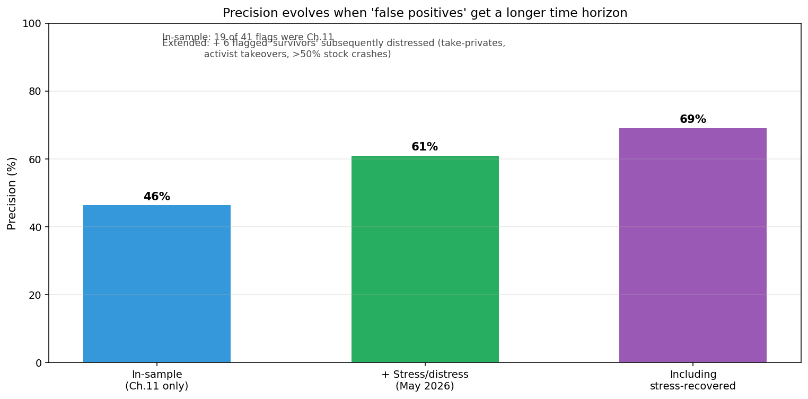

# EdgarRisk

**A two-signal text-based corporate distress detector built on SEC 10-K risk disclosures.**

Across 24 corporate failures and 42 sector-matched survivors spanning 15 sectors, the model achieves **79% recall** on Chapter 11 events within the test window and **61% precision at a 2-3 year extended horizon** — meaning many of the apparent "false positives" turned out to be early signals of distress that crystallized later (Nordstrom take-private May 2025, Walgreens Sycamore deal 2025, Kohl's takeover bids 2024, Macy's activist pressure, CVS -50% stock).

The full writeup is in [ARTICLE.md](ARTICLE.md). Phase-by-phase findings are in [outputs/](outputs/).

## Headline chart



When the "false positives" from the in-sample test are tracked forward 2-3 years to May 2026, 6 of 22 (27%) underwent material distress events — take-privates under duress, activist takeover campaigns, or 50%+ stock crashes. Precision evolves from 46% (in-sample, Chapter 11 only) to 61% (extended horizon, including non-Ch.11 distress) to 69% (also counting stress-but-recovered).

## What the model is

Three signals scored peer-relative against a sector-matched cohort of 3-5 survivors:

1. **Novelty spike** — `max_pct_rank >= 0.75` in any lookback year AND `failure_max_raw_novelty >= 0.10`. Catches companies undergoing significant disclosure rewriting (restructuring, ongoing litigation, post-event responses).
2. **Declining under-disclosure** — `t0_rank <= 0.34` AND rank declined by >= 0.20pp AND cohort was active. Catches the "previously active, then suspiciously quiet" pattern (Spirit Airlines pre-Ch.11; opioid-litigation suppression in Endo and Mallinckrodt).
3. **Chronic under-disclosure** — mean rank <= 0.34 AND max rank <= 0.50 AND own raw novelty < 0.10. Catches always-frozen disclosure even in active sectors (Express, SmileDirectClub).

The underlying metric is TF-IDF cosine similarity between consecutive years of a company's Risk Factors section. Novelty = `1 − cosine_sim(year N, year N-1)`. Percentile rank is computed against the failure's 3-5 sector-matched survivor cohort.

## The data

24 failure case studies (10-K filings 2014-2025), each paired with a 3-5 company sector cohort:

| Failure | Sector | Event | Detection |
|---|---|---|---|
| BBBY | Specialty retail | Bed Bath & Beyond Ch.11 (Apr 2023) | ✓ |
| SHLD | Department store | Sears Ch.11 (Oct 2018) | ✓ |
| JCP | Department store | J.C. Penney Ch.11 (May 2020) | ✓ |
| PIR | Home goods | Pier 1 Ch.11 (Feb 2020) | ✓ |
| ASNA | Specialty retail | Ascena Ch.11 (Jul 2020) | ✓ |
| EXPR | Specialty apparel | Express Ch.11 (Apr 2024) | ✓ |
| RAD | Drugstore | Rite Aid Ch.11 (Oct 2023) | ✓ |
| WE | Commercial real estate | WeWork Ch.11 (Nov 2023) | ✓ |
| YELL | LTL trucking | Yellow Corp Ch.11 (Aug 2023) | ✓ |
| TUP | Household consumer | Tupperware Ch.11 (Sept 2024) | ✓ |
| NKLA, RIDE, FSR | EV / cleantech | Multiple 2023-2025 Ch.11s | ✓ |
| CHK, WLL | Energy E&P | 2020 oil-crash bankruptcies | ✓ |
| ENDP, MNK | Specialty pharma | Opioid-litigation Ch.11s | ✓ |
| SDC | Dental / consumer | SmileDirectClub Ch.11 (Sept 2023) | ✓ |
| SAVE | ULCC airline | Spirit Airlines Ch.11 (Nov 2024) — **held-out test** | ✓ |
| BA | Aerospace | Boeing 737 MAX (Oct 2018) | (industry shock — not designed to catch) |
| SIVB | Commercial bank | SVB collapse (Mar 2023) | (sudden shock — not designed to catch) |
| SI | Crypto bank | Silvergate wind-down (Mar 2023) | (sudden shock — not designed to catch) |
| PTON | Subscription fitness | Peloton drawdown (FY2022) | (chronic anomaly — not designed to catch) |
| HTZ | Car rental | Hertz Ch.11 (May 2020) | (static cohort — not designed to catch) |

42 unique survivor companies across the same 15 sectors are pulled into one or more cohorts.

## Key findings

1. **A continuous Distress Score (0-100) ranks companies for tool/lookup use.** See [outputs/phase6_distress_score/](outputs/phase6_distress_score/). Top of the ranking: 4 of 6 score-70 observations are real distress (3 Ch.11 + 1 subsequent take-private attempt). PPV at score ≥ 60 is 67% under extended-horizon labels. The score is a transparent rule-based weighted sum of the three binary signals plus a small percentile-rank tiebreaker — not ML — because at N=102 a logistic regression produced worse-than-random rankings (OOF AUC=0.35). Honest framing: it's a ranking affordance, not an independent classifier.
2. **Novelty + under-disclosure together catch 79% of slow-burn failures (19/24).** The 5 misses each fall into one of 7 named structurally-undetectable subclasses.
2. **Absolute sentiment is anti-predictive in retail.** Every retail failure (5/5) had *less* negative language than its healthy peers because established retailers carry structural disclosure burden (store closures, leases) that loads up Loughran-McDonald Negative vocabulary even when healthy.
3. **Opioid-litigation pharmaceuticals (Endo, Mallinckrodt) both fired the under-disclosure signal**, consistent with the well-known asymmetric incentive: defense counsel routinely advises reducing risk-factor updates during active litigation to avoid plaintiff-friendly admissions.
4. **Methodology stress test:** Spirit Airlines tested out-of-sample after methodology lockdown (Phase 1D) — missed by novelty-spike, caught by the under-disclosure signal that was added in Phase 2C.
5. **The longitudinal correction (Phase 5) is the project's strongest finding.** Of the 22 "false positives," 27% subsequently underwent material distress events. The model is best characterized as a 1-3 year leading indicator of operational distress, not a real-time bankruptcy predictor.

## Reproducing the results

The project uses [uv](https://github.com/astral-sh/uv) for environment management. Dependencies are pinned in `uv.lock`.

```bash
# Install dependencies
uv sync

# Fetch + parse + score one company
uv run python skills/fetch_10k.py --ticker BBBY --years 5
uv run python skills/section_parser.py --ticker BBBY
uv run python skills/sentiment_scorer.py --ticker BBBY
uv run python skills/novelty_scorer.py --ticker BBBY

# Run the full Phase 5 analysis (regenerates the headline chart)
uv run python analysis/phase5_longitudinal.py
```

Each phase's analysis script is self-contained and reads from `data/processed/`. Re-running them regenerates the corresponding chart and CSV in `outputs/`.

## Project structure

```
EdgarRisk/
├── README.md                 # This file
├── ARTICLE.md                # Full canonical writeup (~2,800 words)
├── CLAUDE.md                 # Project agent guide
├── agents/
│   ├── filing_agent.md       # Data pipeline agent (fetch + parse + diff)
│   └── analyst_agent.md      # Interpretation agent (sentiment + memo)
├── skills/                   # Reusable atomic skills
│   ├── fetch_10k.py          # Download from EDGAR (ticker or CIK)
│   ├── section_parser.py     # Extract Risk Factors + MD&A
│   ├── sentiment_scorer.py   # Loughran-McDonald LM dictionary
│   ├── novelty_scorer.py     # TF-IDF YoY cosine similarity
│   ├── redflag_detector.py   # Legacy keyword detector (superseded by sentiment)
│   ├── risk_classifier.py    # 8-category risk classification
│   ├── yoy_diff.py           # Year-over-year risk diff
│   └── memo_writer.py        # Investor memo generation
├── analysis/                 # Per-phase analytical scripts
│   ├── phase0_validation.py
│   ├── phase1a_sentiment.py
│   ├── phase1b_novelty.py
│   ├── phase1c_percentile.py
│   ├── phase1d_spirit.py
│   ├── phase2a_retail.py
│   ├── phase2b_industrial.py
│   ├── phase2c_underdisclosure.py
│   ├── phase3_scale.py
│   ├── phase4_chronic.py
│   └── phase5_longitudinal.py
├── data/
│   ├── reference/
│   │   └── LoughranMcDonald_MasterDictionary.csv  # 1993-2024, frozen
│   ├── raw/                  # 10-K HTML (gitignored, regenerable)
│   │   └── *_manifest.json   # Per-ticker filing manifests (tracked)
│   └── processed/            # Parsed JSON + sentiment + novelty (tracked)
└── outputs/                  # One subdirectory per phase
    ├── phase0_viability/          # Phase 0: 5-pair case-control viability check
    ├── phase1a_sentiment/         # Phase 1A: Loughran-McDonald sentiment scoring
    ├── phase1b_novelty/           # Phase 1B: TF-IDF YoY novelty + composite scoreboard
    ├── phase1c_methodology_lockdown/  # Phase 1C: cohorts + percentile-rank scoring
    ├── phase1d_spirit_oos/        # Phase 1D: Spirit Airlines out-of-sample test
    ├── phase2a_retail/            # Phase 2A: 5 retail failures
    ├── phase2b_industrial/        # Phase 2B: 3 industrial sectors (WE, YELL, TUP)
    ├── phase2c_underdisclosure/   # Phase 2C: declining-under-disclosure signal
    ├── phase3_scale/              # Phase 3: scale to 24 failures across 15 sectors
    ├── phase4_chronic_and_fp/     # Phase 4: chronic-UD + false-positive validation
    ├── phase5_longitudinal/       # Phase 5: longitudinal follow-up (hero finding)
    ├── phase6_distress_score/     # Phase 6: rule-based 0-100 score for ranking
    └── legacy/                    # Original Boeing pilot memo
```

Each phase subdirectory holds its `findings.md` plus charts (`.png`) and tables (`.csv`).

## Data sources and caveats

- **10-K filings:** SEC EDGAR (free, public). Pulled via `data.sec.gov/submissions` and `sec.gov/Archives`. EDGAR requires a User-Agent header identifying the requester per fair-access policy.
- **Loughran-McDonald dictionary:** 1993-2024 master dictionary (3,876 sentiment-tagged words), bundled in `data/reference/`. Originally hosted by Notre Dame SRAF on a Google Drive page; checked in here for reproducibility. Licensed for non-commercial research.
- **Failure event dates:** publicly known Chapter 11 filings as reported in news and SEC filings.
- **Survivor matching:** hand-picked sector + size peers for each failure. Cohort selection is the single judgment call where my methodology has discretion.

### Known data gotchas worth flagging

- FDIC-supervised banks (First Republic, Signature Bank) don't file SEC 10-Ks. SEC-text-based studies of bank failures have a structural blind spot for this class.
- Companies taken private (JWN/Nordstrom 2025, WBA/Walgreens 2025) drop out of EDGAR's active ticker map but keep their CIK. Pipeline handles via `--cik` flag.
- Post-bankruptcy tickers get a "Q" suffix (SAVE → SAVEQ → FLYYQ for Spirit Airlines). The CIK persists.

## Methodology notes

- **Peer-relative scoring is not optional.** Absolute Loughran-McDonald Negative-word ratio is a sector classifier, not a failure indicator — banks (regulatory-heavy disclosure) have higher baseline negativity than every failure in our dataset. Direct cross-company comparisons are meaningless without sector control.
- **The lookback window is t-3 to t-0 (last four annual 10-Ks before the event).** Some failures have shorter windows where post-IPO history doesn't reach back that far (Peloton, Spirit, Silvergate).
- **Discrete percentile space.** With a 4-company cohort (1 failure + 3 survivors), percentile ranks are {0.25, 0.50, 0.75, 1.00}. Larger cohorts (5-6 companies) smooth this distribution. The cohort sizes vary by failure due to peer availability.
- **The "raw novelty floor" of 0.10** screens out spurious signal from static cohorts (e.g., the regional banks SVB was compared against had ~0.02-0.06 raw novelty across all years; absolute movement was trivial even when SVB happened to rank highest).

## What the model does NOT do

- It does **not** predict the *timing* of bankruptcy. Most spike signals fire 1-2 years before the event.
- It does **not** detect **sudden balance-sheet failures** (SVB, Silvergate). No textual fingerprint exists for events that happen between annual filings.
- It does **not** detect **chronic anomalies** (Peloton was at the cohort extreme on multiple signals from day one — no trajectory to read).
- It does **not** detect **industry shocks** (Boeing pre-MAX — management didn't yet know).
- It does **not** detect **under-disclosure failures with no peer trajectory** (Hertz's car rental cohort was uniformly quiet, so there was no peer activity to compare against).

These are mechanistic blind spots, not bugs. They're enumerated and named.

## Contact

Shane Thakkar — `shane.thakkar@gmail.com`

This project was developed iteratively over 12 phases with Claude as a coding pair. Git history captures the narrative arc and each phase's findings.
