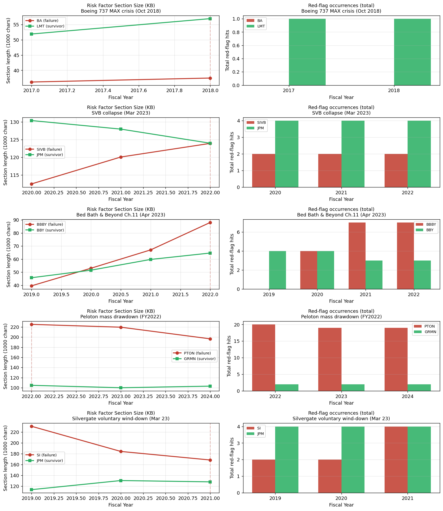

# Phase 0 — Minimum Viable Validation

**Question:** Does risk-disclosure language in 10-K filings measurably differ between companies that subsequently failed and sector-matched survivors?

**Method:** 5 case-control pairs. For each failure, the last 10-K filed before the failure event was compared to a sector-matched healthy peer's 10-K filed in the same period. Metrics: Risk Factors section character count, Risk Factors item count, total red-flag phrase occurrences.

**Sample size: 10 companies × 3–9 fiscal years each.** Not statistically conclusive — this is a viability check on the thesis, not a finished study.

## Case-control pairs

| Failure | Survivor | Event | Lookback window |
|---|---|---|---|
| BA (Boeing) | LMT (Lockheed) | 737 MAX crisis (Oct 2018) | FY2017–FY2018 |
| SIVB (SVB Financial) | JPM (JPMorgan) | SVB collapse (Mar 2023) | FY2020–FY2022 |
| BBBY (Bed Bath & Beyond) | BBY (Best Buy) | Ch.11 (Apr 2023) | FY2019–FY2022 |
| PTON (Peloton) | GRMN (Garmin) | mass drawdown (FY2022) | FY2022–FY2024 |
| SI (Silvergate) | JPM (JPMorgan) | Voluntary wind-down (Mar 2023) | FY2019–FY2021 |

*FRC (First Republic Bank) was originally included but dropped — see Finding 6.*

## Headline result

| Pair | Failure Δ (Risk-section size) | Survivor Δ | Spread |
|---|---|---|---|
| BA vs LMT | **+3.6%** | +9.7% | **survivor grew more** |
| SIVB vs JPM | **+10.2%** | -4.9% | failure grew more (+15pp) |
| **BBBY vs BBY** | **+122.9%** | +41.4% | **failure grew dramatically more (+81pp)** |
| PTON vs GRMN | **-12.7%** | -1.5% | failure shrunk more |
| SI vs JPM | **-27.0%** | +12.7% | failure shrunk more |

**Only 2 of 5 failures showed the "disclosure expansion" pattern we expected. The naive hypothesis is wrong.**

## Findings

### 1. Disclosure-volume growth is not a universal failure signal

Three of five failures (BA, PTON, SI) showed flat or shrinking risk sections pre-collapse. The hypothesis that troubled companies always pile on risk language is too simplistic.

### 2. BBBY is the showcase — and it's the article's hero example

Bed Bath & Beyond's risk-factors section grew from 39K to 88K characters in three years, more than tripling. Sector-matched Best Buy grew only 41% in the same period. Red-flag occurrences went from 0 to 7. This is exactly the "predictable slow-burn failure" the model is supposed to catch.

### 3. Sudden market-shock failures leave no textual warning

SVB Financial's FY2022 10-K — filed weeks before the bank collapsed — looks unremarkable. Their failure was a rate-shock + bank-run event, not a multi-year governance breakdown. Silvergate's pre-collapse 10-Ks actually *shrunk*. **Text-based signals likely cannot predict sudden market-driven failures.** They can probably only predict operational/governance failures with multi-year deterioration.

### 4. The red-flag detector has too much boilerplate noise

JPMorgan (healthy) and Garmin (healthy) both show consistent red-flag hits across every year — "going concern" matches a standard accounting-policy disclosure ("these statements are prepared on a going-concern basis"), not the auditor's substantial-doubt warning. "Class action" matches generic litigation-risk boilerplate. Every public company has these.

**Fix:** the next iteration needs context-aware matching. "Substantial doubt about our ability to continue as a going concern" is the signal; "going concern basis" is noise. Same for "we are subject to a class action lawsuit alleging..." vs "class actions could harm us in the future."

### 5. Absolute red-flag counts are meaningless without a peer baseline

Peloton's 10-K had 20+ red-flag occurrences in every year examined. Garmin's had 2. In isolation, Peloton's 20 looks alarming — but it's their baseline, not a signal of recent deterioration. **All metrics need to be normalized against a peer-relative baseline before they mean anything.**

### 6. A meaningful fraction of US bank failures aren't in SEC data at all

First Republic Bank (CIK 0001132979) and Signature Bank are both state-chartered, FDIC-supervised banks. They filed their annual reports with the FDIC, not as SEC 10-Ks. **Any SEC-text-based study of bank failures has a structural blind spot for this entire class of failure.** SVB Financial Group is in EDGAR only because it was a bank *holding company* — the bank subsidiary itself (Silicon Valley Bank, N.A.) wasn't.

**This is an article-worthy methodology note**, not just a footnote.

## Verdict

**The "predict failure" thesis is alive but needs refinement.**

What works:
- Slow-burn operational failures (BBBY-type retail death spirals) likely show measurable pre-collapse disclosure expansion.
- Peer-relative comparison is the right framing (BBBY vs BBY shows clear separation; BBBY in isolation might not).

What doesn't:
- The current red-flag detector is too noisy to use as-is.
- Sudden market shocks (banking failures, crypto-driven liquidations) are probably unpredictable from 10-K text.
- The hypothesis needs to be narrowed: not "predict failure," but "predict slow-burn operational failure."

## Recommended next steps (Phase 1)

1. **Refine the failure dataset.** Filter to slow-burn operational/governance failures with ≥18 months of pre-event deterioration. Drop banks unless they're holding companies with rich SEC disclosures. Source candidates from SEC AAER database (restatements) and LoPucki BRD (Chapter 11s).

2. **Rebuild the red-flag detector** with context windows. Require negation/affirmation context: "auditor expressed substantial doubt" is signal; "going concern basis" is noise.

3. **Add Loughran-McDonald sentiment scoring.** Normalized counts of `negative`, `uncertain`, `litigious` financial words. This is the canonical finance-NLP signal and will be more robust than keyword matching.

4. **Add novelty scoring.** TF-IDF or embedding similarity between consecutive years' risk sections. *Most disclosure is boilerplate; when boilerplate breaks, that's the signal.*

5. **Build peer-relative scoring**, not absolute. Every metric should be normalized against a same-sector, same-size cohort for that year.

## Parser quality notes (for Phase 1 hardening)

The pilot exposed several parser failures that need fixing before scaling:

- **JPM**: MD&A extraction returns only 395 chars across all 4 years (parser failing to locate Item 7).
- **LMT FY2022**: Only 5 risk factors extracted vs. 17–19 in other years (broken segmentation).
- **SI FY2019**: 113 risk factors extracted vs. 78–86 in other years (over-segmenting paragraphs as separate items).
- **Lesson:** Risk Factors item *count* is unreliable across companies because companies use different sub-heading conventions. Character count is the more robust volume metric.

## Files produced

- `outputs/phase0_metrics.csv` — long-form metrics table (company × year)
- `outputs/phase0_yoy_summary.csv` — per-pair growth deltas
- `outputs/phase0_comparison.png` — side-by-side comparison chart
- `data/processed/*_FY*_parsed.json` — parsed Risk Factors + MD&A for all 10 companies
- `data/processed/*_redflags.json` — red-flag detection results
