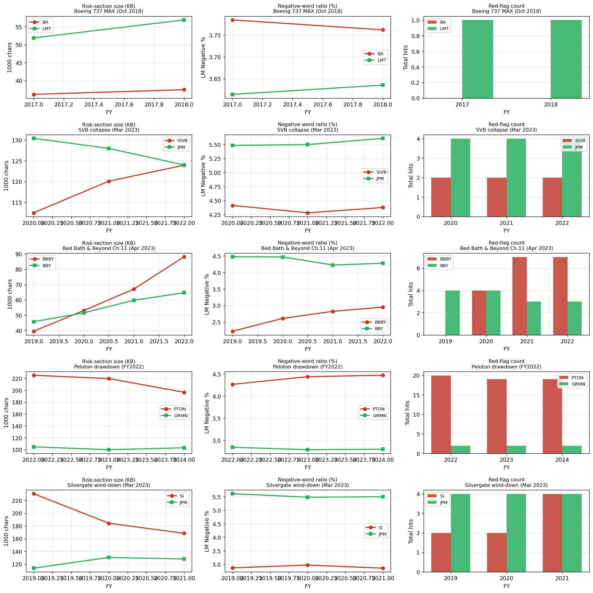

# Phase 1A — Loughran-McDonald Sentiment Scoring

**Goal:** Replace the noisy keyword-based red-flag detector with the canonical finance-NLP signal — Loughran-McDonald word-frequency ratios — and see whether sentiment trajectories separate failures from survivors more cleanly than disclosure volume alone.

**Method:** Tokenize each year's Risk Factors section, count words matching each LM category (Negative, Positive, Uncertainty, Litigious, Strong/Weak Modal, Constraining), normalize by total token count. Compare per-ticker trajectories across the same 5 failure/survivor pairs from Phase 0.

**Dictionary:** Loughran-McDonald Master Dictionary 1993-2024, 3,876 tagged English words across 7 sentiment categories. Source: SRAF / Notre Dame.

## Headline result

| Pair | Failure Δ Negative% (pp) | Survivor Δ Negative% (pp) | Spread (F−S) | Size growth (F) |
|---|---|---|---|---|
| BA vs LMT (2017→18) | -0.02 | +0.02 | -0.04 | +3.6% |
| SIVB vs JPM (2020→22) | -0.04 | +0.13 | -0.17 | +10.2% |
| **BBBY vs BBY (2019→22)** | **+0.73** | **-0.20** | **+0.93** ⭐ | **+122.9%** |
| **PTON vs GRMN (2022→24)** | **+0.21** | **-0.04** | **+0.25** ⭐ | **-12.7%** |
| SI vs JPM (2019→21) | -0.01 | -0.11 | +0.10 | -27.0% |

## Findings

### 1. Sentiment + volume together separate slow-burn failures from sudden ones

Two signals now exist — risk-section *size* and Negative-word *ratio*. Looking at them together cleanly partitions the failures:

- **Slow-burn operational decline** (BBBY, PTON) → both signals fire. BBBY: more risk text AND darker language. PTON: less risk text but DENSER negative language. Both show clear pre-event deterioration.
- **Sudden market shocks** (SVB, Silvergate) → neither signal fires. The text genuinely contains no warning because the failure wasn't an operational deterioration; it was a balance-sheet/rate event that happened between filings.
- **Industry crisis hitting a healthy firm** (BA pre-MAX) → neither fires in the window we have. Boeing didn't see the MAX issues coming when they filed FY2017/FY2018.

**This is the article's headline finding.** Not "10-Ks predict failure" but: *"10-K language predicts the specific class of failure where management gradually loses control over a year-plus timeframe — and gives no warning for failures that happen between filing dates."*

### 2. BBBY's sentiment trajectory is the cleanest signal in the project

Bed Bath & Beyond's Negative-word ratio climbed monotonically from **2.22% (FY2019) → 3.08% (FY2023)** — a +39% relative increase. Sector-matched Best Buy stayed in the 4.2-4.8% range with no trend. The Litigious-word ratio jumped 3x in BBBY's final 10-K (0.63% → 2.10%). This is exactly the pattern a working model should detect.

### 3. PTON shows that volume alone misses signals

PTON's risk section *shrunk* from FY2022 to FY2024 (-12.7%), which on the volume-only view of Phase 0 looked like a non-signal. But the LM Negative ratio climbed from 4.27% → 4.48% (+0.21pp) while sector-match Garmin stayed flat. **Peloton wrote fewer words about risk, but those words got darker.** A composite metric (volume × intensity) is more robust than either alone.

### 4. Absolute Negative% is a sector classifier, not a failure predictor

The dataset reveals a clear hierarchy of baseline negativity:

| Business model | Negative% baseline | Examples |
|---|---|---|
| Money-center bank | ~5.5–6.3% | JPM |
| Regional bank | ~4.3–5.5% | SIVB, TFC |
| Defense / aerospace | ~3.6–4.1% | LMT, BA |
| Consumer subscription | ~4.3–4.5% | PTON |
| Specialty retail | ~4.2–4.8% | BBY |
| Consumer device maker | ~2.8% | GRMN |

JPMorgan (healthy) has a *higher* baseline Negative% than every failure case in the dataset. The reason: regulated banking requires lengthy disclosure of credit risk, market risk, regulatory risk — all of which use LM-Negative words like "loss," "decline," "adverse." **Any model that ranks by absolute sentiment level will rank JPM as more at-risk than BBBY.** Only year-over-year *change* — and ideally peer-relative change — has predictive value.

This finding strengthens the case for the article's methodology section: "Why I had to compare each company only to itself and to a sector peer, not to a global benchmark."

### 5. Litigious-word ratio is the leading sub-signal for retail bankruptcy

BBBY's Litigious-word ratio jumped from **0.63% (FY2022) → 2.10% (FY2023)** in their final 10-K — a 3.3x increase. This corresponds to language around lawsuits, claims, settlements, indemnification. Other failures (PTON, SI, SIVB) did NOT show a Litigious spike, suggesting this sub-signal is specific to companies sliding toward an actual creditor/legal endgame.

Worth promoting Litigious to a tracked metric independent of the composite Negative score.

## Comparison to Phase 0 results

| Metric | Phase 0 (volume + keyword red flags) | Phase 1A (LM sentiment added) |
|---|---|---|
| BBBY signal strength | Strong (+123% volume) | Stronger (+123% volume + monotonic sentiment rise + Litigious spike) |
| PTON signal | Missed (shrunk -13%) | **Detected** (intensifying negative language) |
| SVB / Silvergate | Correctly absent | Correctly absent |
| Boilerplate noise problem | Severe | Eliminated — LM ratios are normalized, no false positives from healthy firms |
| Cross-sector comparability | Poor | Worse, actually — absolute LM ratios reflect business model, not risk. Use deltas. |

## What still doesn't work

- **The 5-pair sample size is too small to call any of this statistically real.** This is still a viability check. A real paper needs 30+ failures with matched controls.
- **The red-flag detector still hasn't been improved.** Phase 1A doesn't fix that — Phase 1B should rebuild it with context-aware matching.
- **Sentiment doesn't separate sudden failures from healthy peers**, which is expected but worth being explicit about. The model has a hard ceiling on what kinds of failure it can predict.

## Recommended next moves

Three Phase 1B candidates, in order of expected impact:

1. **Novelty scoring (TF-IDF / embedding similarity YoY).** Quantify how much of each year's risk text is *new* vs boilerplate. The hypothesis: when boilerplate breaks, that's the signal. This is the most novel methodology contribution of the project and would round out the trinity of metrics (volume / sentiment / novelty).

2. **Scale the failure dataset.** Curate ~30 slow-burn failures from SEC AAER + LoPucki BRD. Without more cases, the article can't credibly claim "the signal works in general" — only "the signal worked for BBBY and PTON."

3. **Rebuild the red-flag detector with context windows.** Lower-priority now that LM sentiment has replaced it as the primary text signal — but the red-flag detector might still serve as a binary "fire alarm" layer (going-concern auditor opinion, restatement, investigation) on top of sentiment.

## Files produced

- `data/reference/LoughranMcDonald_MasterDictionary.csv` — frozen LM dictionary (3,876 sentiment-tagged words, 1993-2024 edition)
- `skills/sentiment_scorer.py` — new skill, run with `--ticker {T} --section {risk_factors|mdna|combined}`
- `data/processed/{T}_sentiment_risk_factors.json` — per-year LM scores for all 10 tickers
- `outputs/phase1a_sentiment/sentiment_trajectories.png` — single-panel headline chart, x = years-before-event
- `outputs/per_pair.png` — 5 pairs × 3 panels (size, sentiment, red flags)
- `outputs/phase1a_sentiment/metrics.csv` — long-form metrics table
- `outputs/phase1a_sentiment/yoy_summary.csv` — per-pair sentiment + volume deltas
