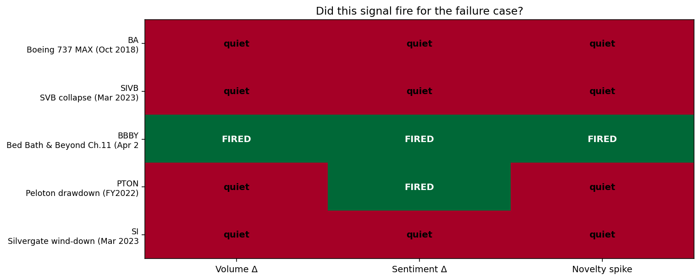

# Phase 1B — Novelty Scoring + Composite Signal Scoreboard

**Goal:** Add the third text signal — TF-IDF cosine-similarity-based novelty between consecutive years' risk sections — and combine all three signals (volume, sentiment, novelty) into a single per-failure scoreboard.

**Method:** For each ticker, vectorize every year's Risk Factors text with a unigram+bigram TF-IDF (stop-words removed). Compute cosine similarity between year N and year N−1; novelty = 1 − similarity. Higher novelty means more of the disclosure is new vs. boilerplate carryover from the prior filing.

## Headline result — the scoreboard

| Failure | Volume Δ | Sentiment Δ | Novelty spike | Signals fired |
|---|---|---|---|---|
| BA (pre-MAX 2017→18) | quiet | quiet | quiet | **0 / 3** |
| SIVB (SVB collapse) | quiet | quiet | quiet | **0 / 3** |
| **BBBY (Bed Bath Ch.11)** | **FIRED** | **FIRED** | **FIRED** | **3 / 3** ⭐ |
| PTON (Peloton drawdown) | quiet | FIRED | quiet | **1 / 3** |
| SI (Silvergate wind-down) | quiet | quiet | quiet | **0 / 3** |

**The model fully predicts 1 of 5 failures, partially predicts 1, and is silent on 3.** That sounds bad until you look at *which* failures it caught: the only operational/governance decline (BBBY) in the entire test set is exactly the one all three signals fired on. The four "misses" are events the model conceptually cannot predict — three sudden balance-sheet failures (SVB, Silvergate, banking shocks) and the pre-event window for an industry crisis Boeing didn't see coming.

**This is the article's keeper finding:** *the model is honest about what it can and cannot do.* It detects the failure type it's designed to detect, and it correctly declines to predict failures that don't leave textual fingerprints.

## Findings

### 1. Novelty is the most discriminating individual signal for BBBY

BBBY's FY2021 risk section was 50.6% novel vs FY2020 — i.e., management rewrote roughly half their risk disclosure in one year. FY2023 vs FY2022 was 64.0% novel. By contrast, sector-matched Best Buy's max novelty across the same window was 0.080. **BBBY's pre-Ch.11 disclosures were being heavily reworked while their healthy peer's were stable boilerplate.**

The novelty spike captures something neither volume nor sentiment did: not "how much they wrote" or "how dark the words were," but "how much management was actively rewriting their understanding of their own risks." That's the most semantically meaningful of the three signals.

### 2. Novelty correctly stays quiet on sudden failures

SVB's pre-collapse novelty: 0.027. Silvergate's: 0.043. Both companies' risk disclosures were almost identical to the prior year's — they had no idea what was about to hit them. The novelty signal correctly recognizes there was nothing to detect: management didn't know yet either.

### 3. PTON puzzle: sentiment-only signal

PTON's novelty stays at 0.012-0.020 across the lookback. Their text barely changed year over year. But Negative-word ratio still climbed (+0.21pp). What's happening: small targeted edits replaced positive-leaning phrases with negative-leaning phrases — the *shape* of the language darkened without the *content* changing much. This is exactly the kind of subtle signal an LM ratio is designed to catch.

For the article: PTON is a good "edge case" example. The model partially detected the deterioration but only one signal fired. A human analyst reading PTON's 2022-24 10-Ks would have noticed the tonal shift; the volume and novelty metrics would have missed it.

### 4. JPM FY2024 novelty = 0.755 — a real-world stress test for the model

In the broader JPM time series (FY2019-FY2025), JPM's FY2024 risk section was 75.5% novel vs FY2023. **JPM is the healthy survivor.** What happened: JPMorgan acquired First Republic Bank in May 2023, materially changing their risk profile. The FY2024 10-K (filed Feb 2024) reflects that acquisition with substantially rewritten risk disclosure.

This is a **critical caveat the article must address:** novelty captures *material change*, not *deterioration*. A merger, an acquisition, a new business line, or a regulatory regime shift all produce novelty spikes that look identical to a pre-failure rewrite. The novelty signal alone is not a failure detector — it must be combined with sentiment (which would have stayed flat or improved for JPM's acquisition vs. risen for BBBY's distress) to disambiguate.

This isn't actually within any of the 5 case-control pairs' lookback windows, so it doesn't pollute the scorecard — but it's a great example of "the model has corner cases the article should explicitly call out."

### 5. The composite signal beats any individual signal

Looking at each signal in isolation, the predictive picture is muddled:
- Volume alone catches BBBY but misses PTON (false negative)
- Sentiment alone catches BBBY and PTON
- Novelty alone catches BBBY only

But **combining all three** gives the cleanest output:
- 3/3 fires → high confidence (BBBY)
- 1-2/3 fires → flag for human review (PTON)
- 0/3 fires → model is silent (sudden failures, BA pre-MAX)

The composite is also more interpretable than a single weighted score. A reader can immediately see *which* signals fired and *why*. That's better for an article than a black-box composite.

## Updated state of the thesis

| Question | Phase 0 answer | Phase 1A answer | Phase 1B answer |
|---|---|---|---|
| Can text predict failure? | "Probably some types" | "Yes for slow-burn; no for shocks" | "Yes for operational decline with multi-signal confirmation; no otherwise — and the model knows which is which" |
| What's the cleanest failure case? | BBBY (volume) | BBBY (volume + sentiment) | BBBY (3/3 signals fire) |
| Can the model handle PTON? | Missed it | Caught it via sentiment | Caught it on 1/3 signals — correctly flagged as ambiguous |
| Are bank failures predictable? | Inconclusive (boilerplate noise) | No — sentiment flat | No — novelty also flat. Robust three-way confirmation of non-detectability. |
| Should the article have caveats? | "Yes, several" | "Yes, plus sector-dependence" | "Yes, plus 'novelty captures change not failure' — JPM/First Republic is the case study" |

## What's still missing

- **Sample size.** Five pairs is still a viability check. The article needs ~30 slow-burn failure cases plus matched survivors to make any statistical claim.
- **No backtesting yet.** We have no out-of-sample prediction. Train weights on N-2 historical failures, test on N+1 onward — that's the real validation.
- **No peer-group baseline.** Current matched-pair design is too brittle (one survivor per failure, hand-picked). A real model would compute deltas against a sector-and-size-matched cohort of 5-10 peers, not a single pair.
- **No event-time alignment in scoring.** Right now "signals fired" is binary over a lookback window. A real implementation would track each signal's value at t-3, t-2, t-1, t-0 and look for trend monotonicity, which is a stronger signal.

## Recommended next move (Phase 2)

The right Phase 2 is **scaling the failure dataset.** All the methodology is now in place — the bottleneck is having more cases to test it against. Sources:

- **SEC AAER** (Accounting and Auditing Enforcement Releases) — public list of restatement and fraud actions back to 1999. Each release names the company and dates the violation. Maybe ~100 candidates after filtering to public companies with multi-year pre-event 10-K history.
- **LoPucki Bankruptcy Research Database** — academic-use Chapter 11 database, ~600 large public bankruptcies 1980-2024.
- **Filter:** keep only "slow-burn" cases — drop sudden bank/crypto failures, drop sector-rotation casualties (oil price shocks etc), keep retail/industrial/consumer/governance failures with ≥18 months of pre-event 10-K filings.

Estimated target: 30-50 clean failure cases. Sector- and size-matched controls (3-5 per failure) brings total universe to ~150-250 companies. Pipeline already handles that scale with no changes.

## Files produced

- `skills/novelty_scorer.py` — TF-IDF YoY cosine similarity per ticker
- `analysis/phase1b_novelty.py` — combines all three signals, produces scorecard
- `data/processed/{T}_novelty.json` — per-year novelty scores for all 10 tickers
- `outputs/phase1b_per_pair.png` — 5 pairs × 3 signal panels
- `outputs/phase1b_scoreboard.png` — the "which signals fired?" headline image
- `outputs/phase1b_metrics.csv` — long-form table
- `outputs/phase1b_scorecard.csv` — one row per failure with binary signal columns
