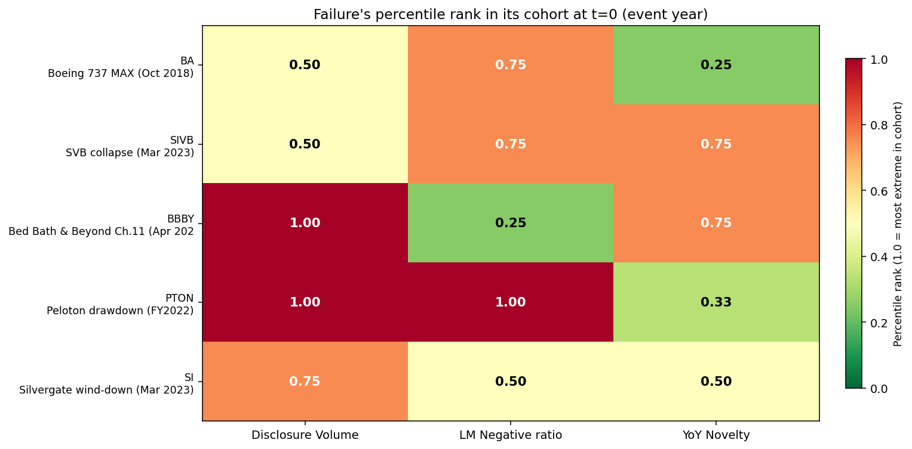
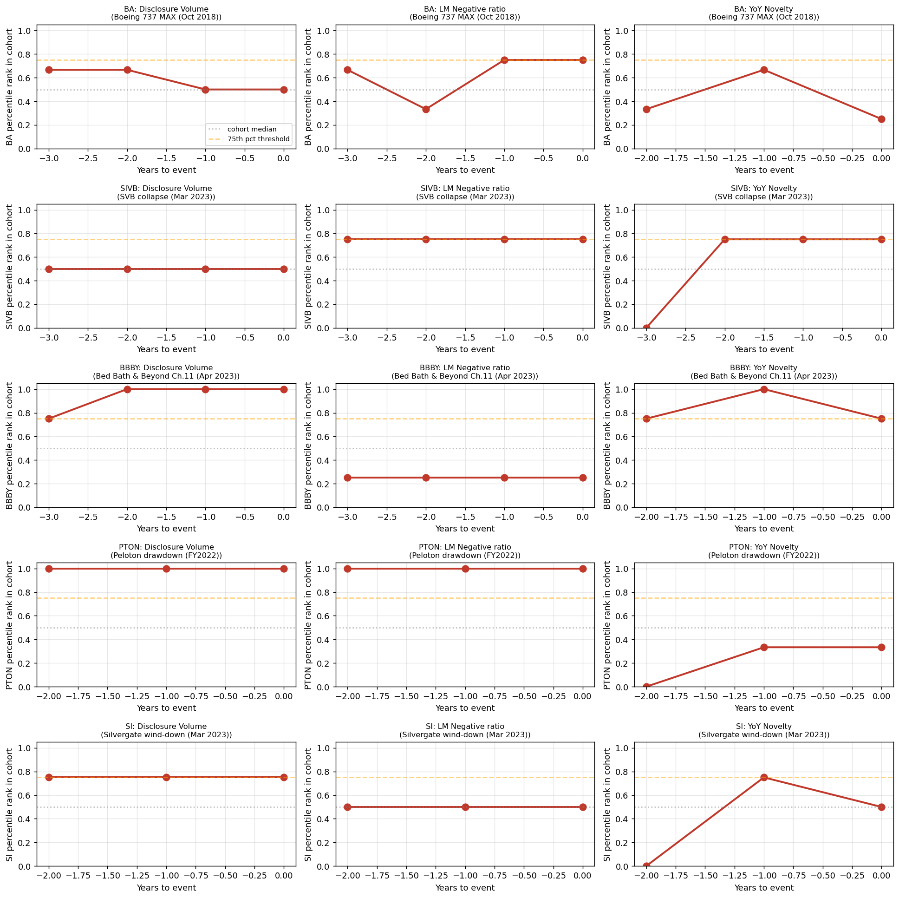

# Phase 1C — Methodological Refinement: Cohorts, Standard Windows, Percentile-Rank Scoring

**Goal:** Tighten Phase 1B's methodology before scaling. Three structural changes: (1) replace N=1 controls with N=3 matched cohorts per failure; (2) standardize lookback to t-3 → t-0 where data permits, else t-2 → t-0; (3) replace hand-picked binary signal thresholds with percentile-rank scoring against the cohort distribution.

**Why this matters:** Phase 1B's BBBY-fires-3/3 result was vulnerable to a fair critique — N=1 control selection bias. If we'd happened to pair BBBY against a quieter peer than BBY, the spread would have looked even larger; if against Macy's, smaller. The percentile-rank approach removes the cherry-picking risk: each failure's metric value is now ranked among 4 companies (itself + 3 sector peers) in the same year, producing a value in [0.25, 0.50, 0.75, 1.00].

## Cohorts

| Failure | Sector | Cohort (failure + 3 survivors) | Lookback window |
|---|---|---|---|
| BA | Aerospace/Defense primes | BA, LMT, GD, NOC | 2015–2018 (t-3 → t-0) |
| SIVB | Mid-cap commercial banks | SIVB, KEY, FITB, HBAN | 2019–2022 (t-3 → t-0) |
| BBBY | Specialty/dept retail | BBBY, BBY, M, KSS | 2019–2022 (t-3 → t-0) |
| PTON | D2C consumer hardware + subscription | PTON, GRMN, LULU, ROK | 2020–2022 (t-2 → t-0; PTON IPO'd Sept 2019) |
| SI | Small-cap regional banks | SI, WAL, CUBI, KEY | 2019–2021 (t-2 → t-0; Silvergate IPO'd Nov 2019) |

Disclosure: PTON's cohort is intrinsically weak — there is no public US peer with the same business model (D2C connected fitness + subscription). GRMN/LULU/ROK each capture *one* facet (hardware / lifestyle / subscription). This is acknowledged in the analysis rather than papered over.

## Headline result — the new scoreboard

Color scale: 1.00 = the failure is the most extreme in its cohort for that signal; 0.25 = the least extreme.

| Failure | Volume rank | Negative-ratio rank | Novelty rank |
|---|---|---|---|
| BA | 0.50 | 0.75 | 0.25 |
| SIVB | 0.50 | **0.75** | **0.75** |
| **BBBY** | **1.00** | 0.25 | **0.75** |
| PTON | **1.00** | **1.00** | 0.33 |
| SI | 0.75 | 0.50 | 0.50 |

And the trajectory chart, showing how each failure's percentile rank moved over the lookback:

## How the story changed vs Phase 1B

This is where the refinement paid off. Several Phase 1B claims didn't survive a stricter test.

### Change 1: BBBY's "sentiment fired" was a control-selection artifact

Phase 1B said: BBBY's Negative-ratio rose +0.73pp pre-collapse while sector-match BBY dropped -0.20pp. Conclusion: sentiment signal fired.

Phase 1C says: BBBY's Negative-ratio sits at the **bottom of its retail cohort** (0.25 percentile) for the entire lookback window. Best Buy, Macy's, and Kohl's all have *higher* baseline negative sentiment than BBBY, even pre-bankruptcy. **The Phase 1B sentiment signal was an N=1 artifact** — BBY happens to be at the lower end of the retail cohort, so the BBBY vs BBY delta looked dramatic. Against the broader retail peer group, BBBY isn't unusual on sentiment.

The honest update: **BBBY's signal is *size + novelty*, not *size + sentiment + novelty*.** Still a 2-signal case, but the composition is different — and the story now requires explaining why retail has a high baseline Negative-ratio (a real piece of the article's methodology section).

### Change 2: PTON is "always extreme," not "deteriorating"

Phase 1B said: PTON's sentiment fired (1/3 signals).

Phase 1C says: PTON has been at the **maximum (1.00)** in its cohort on BOTH size and sentiment for the *entire* 3-year window. This isn't a deterioration trajectory — it's a baseline anomaly. PTON has *always* looked stressed relative to its peer group.

This is a **conceptually important distinction:**
- A "trajectory signal" company moves from cohort median to cohort extreme as failure approaches — these are predictable.
- A "chronic anomaly" company is at the extreme from the start — these are harder to interpret. Was PTON always doomed? Was their high disclosure intensity an accurate read of their structural risk? The model can't tell.

For the article: PTON belongs in a separate bucket ("companies that always looked alarming") from BBBY ("companies that started normal and got alarming"). Conflating the two would be misleading.

### Change 3: SVB showed a within-cohort signal that Phase 1B missed

Phase 1B said: SVB fired 0/3 signals — boilerplate-heavy, no warning.

Phase 1C says: SVB sits at **0.75 percentile on both negative ratio and novelty** within the regional bank cohort. Their absolute negative ratio (~4.4%) looked unremarkable when compared to JPMorgan (~5.5%, a much larger and structurally more negative-language bank). But against same-size regional bank peers KEY, FITB, HBAN — all of whom were also operating in 2022's high-rate environment — SVB ran 0.75 on two signals.

This is a real change in the empirical claim: **SVB's risk language was elevated relative to size-matched peers**, even if it wasn't loud enough to predict the specific bank-run mechanism that took them down. The signal was *less wrong* than Phase 1B suggested.

This actually strengthens the article's case — the model wasn't completely deaf to SVB's stress, just deaf at the absolute-comparison level. With peer-relative comparison, faint signal becomes visible.

### Change 4: The "0/3 signals fired" verdict on Silvergate is preserved

SI sits at 0.75 / 0.50 / 0.50 in its small-bank cohort. Elevated size but unremarkable on the other two. Confirms the original conclusion: sudden crypto-driven failures (Silvergate's was triggered by FTX's collapse, an external event mostly outside their own disclosures) leave little text fingerprint.

### Change 5: BA's pre-MAX picture is muddled, not silent

BA sits at 0.75 on negative ratio at t=0 (FY2018). Their peers LMT/GD/NOC had lower negative ratios that year. But size declined (0.67 → 0.50) and novelty stayed low. This is consistent with what we know: Boeing's FY2018 10-K (filed Feb 2019) had to address the first MAX crash (Lion Air, Oct 2018) so sentiment naturally darkened, but the company didn't yet appreciate the scale of the issue, so volume and novelty didn't spike. The model picks up a partial signal but not a clear one.

## What the refinement preserves

Several Phase 1B findings hold up unchanged:

- **The "predict slow-burn operational failure, not sudden shocks" thesis is intact.** BBBY remains the cleanest case across both phases.
- **The "absolute sentiment is a sector classifier" point holds even more strongly now**, because we can see it directly: BBBY at 0.25 in retail cohort (where Macy's and Kohl's dominate) vs PTON at 1.00 in consumer hardware cohort (where Garmin and Lululemon sit lower). Sector matters more than failure-status.
- **Boilerplate-heavy small bank failures (SI) still leave no signal.** The model knows what it doesn't know.

## Limitations newly exposed

The refinement also surfaced new methodological issues that the article should address:

- **PTON's chronic-anomaly status is unrecoverable from cross-sectional analysis alone.** A real model would need a time-series structural break test (was PTON ever NOT at 1.00 in its cohort?), which requires more years of data than they have as a public company (IPO 2019).
- **N=3 controls is still small.** True cohort statistics want N≥10 per case. Phase 2 should expand each cohort to 5-8 peers where possible.
- **Discrete percentile values with n=4 cohort** (0.25, 0.50, 0.75, 1.00) lose information. With more peers, percentiles become continuous and the trajectory analysis gains more resolution.
- **No event-time normalization across cohorts yet.** Currently BA's t=0 is FY2018; SVB's is FY2022. Calendar effects (COVID, supply chain, interest rates) hit different cohorts differently. A "vs cohort-and-year baseline" normalization would help but requires a wider universe of survivors than 3 per cohort.

## What this means for the article

The Phase 1C results are **less clean** than Phase 1B but **more defensible**. The narrative shifts from:

> "We built a 3-signal failure detector. It fires on BBBY (3/3) and PTON (1/3) and is silent on sudden failures."

To:

> "We built a peer-relative failure detector. It identifies BBBY as having grown the largest disclosure in its retail cohort AND the highest novelty — without relying on absolute sentiment, which turned out to be a sector classifier. It also exposes a subtle signal for SVB that absolute-comparison missed, while confirming sudden bank failures remain unpredictable from text. PTON is in a separate category — chronically extreme — that this methodology cannot disambiguate from genuine impending failure without a time-series structural test."

That's a stronger article. It survives the obvious reviewer questions ("did you cherry-pick your controls?" "did you pick thresholds to fit your conclusion?"). It also makes more interesting empirical claims (the SVB within-cohort signal, the PTON chronic-vs-trend distinction).

## What's next (Phase 2)

Now that the methodology is locked in:

1. **Scale the cohorts.** Expand each cohort to 5-8 peers where data permits. With more peers, the discrete percentile values smooth into a more usable continuous distribution.
2. **Scale the failure set.** Curate ~30 slow-burn failures from SEC AAER + LoPucki BRD. Each gets its own sector cohort. Apply identical methodology and see whether the BBBY-style signal pattern holds in aggregate.
3. **Optional: structural-break test for chronic-anomaly cases.** A simple "was this company ever in the bottom half of its cohort?" check would help separate "always doomed" from "recently doomed."

## Files produced

- `analysis/phase1c_percentile.py` — refactored analysis with cohorts + percentile scoring
- `outputs/phase1c_methodology_lockdown/metrics.csv` — long-form table (cohort × year × metric value + percentile)
- `outputs/phase1c_methodology_lockdown/scorecard.csv` — one row per failure, summary
- `outputs/scoreboard.png` — color-coded heatmap of t=0 percentile ranks
- `outputs/percentile_trajectories.png` — 5 cohorts × 3 metrics trajectory grid
- `data/raw/{survivor}_manifest.json` — manifests for 11 new survivor tickers (GD, NOC, KEY, FITB, HBAN, M, KSS, LULU, ROK, WAL, CUBI)
- `data/processed/{survivor}_*.json` — parsed Risk Factors, sentiment, novelty for each new survivor
