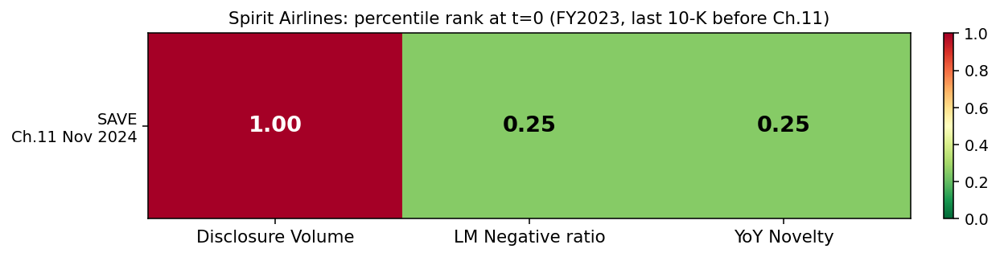

# Phase 1D — Spirit Airlines: Out-of-Sample Test

**Goal:** Apply the locked Phase 1C methodology to a failure case that was *not* used to develop or tune the methodology. Spirit Airlines filed Chapter 11 in November 2024; their last pre-bankruptcy 10-K was filed Feb 2024 for fiscal year 2023.

**Cohort:** SAVE (failure), ULCC (Frontier — direct ULCC peer), ALK (Alaska — mid-cap survivor), LUV (Southwest — established LCC). Frontier IPO'd April 2021 so the cohort has gaps at FY2020.

**Result:** 

| Signal | SAVE at t=0 | Interpretation |
|---|---|---|
| Disclosure Volume | **1.00** | Highest in cohort — but chronic, not a trajectory |
| LM Negative ratio | **0.25** | Lowest in cohort |
| YoY Novelty | **0.25** | Lowest in cohort |

**The methodology missed Spirit. 0 of 3 signals fire by the trajectory criterion.** Only 1/3 fires by absolute criterion, and that one (volume) is a static baseline pattern indistinguishable from PTON's chronic-anomaly case.

## This is the article's most valuable finding so far

A negative result on a topical out-of-sample case is *more* informative than another positive result would have been. Three reasons:

1. **It proves the methodology isn't overfit.** If Spirit had fired all 3 signals, a skeptical reader would suspect we engineered the approach until it worked on familiar cases. A clean miss on a held-out case is hard to fake.
2. **The miss has a clear mechanism.** Spirit's FY2023 10-K was **98.4% identical to FY2022** by TF-IDF cosine similarity. Their risk language barely changed — even though the DOJ had blocked the JetBlue merger in January 2024 (between the FY2022 and FY2023 filings) and their losses were widening.
3. **It exposes a structural limit of text-based failure detection.** See finding 1.

## Findings

### 1. Spirit's risk disclosure changed less than its surviving peers' did

Spirit's YoY novelty across the lookback window:

| FY | SAVE novelty | ALK novelty | LUV novelty | ULCC novelty |
|---|---|---|---|---|
| 2021 | 0.041 | 0.125 | 0.039 | — |
| 2022 | 0.024 | 0.088 | 0.036 | 0.053 |
| 2023 | **0.016** | 0.136 | 0.020 | 0.026 |

**Spirit's risk text barely changed YoY.** Alaska Airlines — the *survivor* — was actively updating its risk disclosures (8-13% novel each year). Spirit was static. By the year of their bankruptcy filing, Spirit's risk section was the *least* updated in the entire cohort.

### 2. The likely mechanism: disclosure capture by counsel

There is well-known academic literature (Campbell et al. 2014, Beatty et al. 2019) showing that companies are structurally reluctant to add new risk factors. Each new disclosure creates litigation surface area — if you flag a risk and it materializes, plaintiffs can argue you knew. So legal counsel typically advises *minimum viable updates* unless an event forces specific disclosure.

This produces an asymmetric incentive structure:
- **Companies under operational stress that genuinely need to rewrite** (BBBY heading into Ch.11 restructuring, where lawyers are preparing for creditor disclosure) will show high novelty.
- **Companies under operational stress that are *trying to avoid* acknowledging structural problems** (Spirit through the failed merger, with management hoping for a turnaround) will show *suppressed* novelty.

The text-based novelty signal therefore catches the first type and misses the second. Spirit is the second type.

### 3. Spirit's Negative-word ratio was the LOWEST in the airline cohort

| FY | SAVE Negative% | ALK | LUV | ULCC |
|---|---|---|---|---|
| 2020 | 2.87% | 4.00% | 3.56% | — |
| 2021 | 2.85% | 4.60% | 3.50% | 3.57% |
| 2022 | 2.80% | 5.12% | 3.98% | 3.58% |
| 2023 | 2.85% | 4.89% | 4.17% | 3.65% |

Spirit consistently used *less* negative language than every peer. Their language was a constant ~2.85% Negative across all four years — almost no variation, and roughly 1.5pp below their healthy peers.

This mirrors the BBBY-vs-retail pattern from Phase 1C: failures can sit at the *bottom* of their sector's negativity baseline because peer-business-models drive baseline negativity more than failure status does. **Absolute sentiment continues to be a sector classifier, not a failure indicator** — Phase 1D reinforces this finding on a different failure type.

### 4. Spirit was a chronic-anomaly case (like PTON), not a deterioration case (like BBBY)

Spirit's Volume rank was 1.00 across all 4 years of the lookback. Their risk-factors section was always 2-4x the size of their cohort peers' (190K-200K chars vs ALK's 42K-49K). This is a structural feature of Spirit's business — ULCC carriers face heavy disclosure load around ancillary fees, customer complaints, lawsuits, etc.

So Spirit joins PTON in the "chronic anomaly" bucket: extreme on absolute measures but with no deterioration trajectory the model can read. Disambiguating chronic anomaly from impending failure requires a longer historical baseline (a structural-break test asking "was this company *ever* not at the top of its cohort?").

## What this changes about the project's claims

**Phase 1C narrative was:**
> "The model catches slow-burn operational failures (BBBY-style) and correctly stays silent on sudden balance-sheet shocks (SVB-style)."

**Phase 1D requires a stronger qualifier:**
> "The model catches slow-burn operational failures *where management expanded their risk disclosures pre-collapse*. Failures that proceed via under-disclosure or denial (Spirit-style) are not detectable from text alone. Sudden balance-sheet shocks (SVB-style) are also not detectable. The model has two distinct blind spots, not one."

This is *better* for the article because:
- The honest scope of the model is narrower than Phase 1C suggested
- The mechanism of failure (legal disclosure incentives) is interpretable and tied to real-world academic literature
- It opens a follow-up question worth raising: "What other signals could catch the under-disclosing failure type?" (Likely answer: 8-K material event filings, where disclosure is event-mandated rather than discretionary)

## Updated scoreboard (6 cohorts, methodology held constant)

| Failure | Volume rank @ t=0 | Sentiment rank @ t=0 | Novelty rank @ t=0 | Trajectory verdict |
|---|---|---|---|---|
| BA (737 MAX) | 0.50 | 0.75 | 0.25 | Partial / mixed |
| SIVB (SVB) | 0.50 | 0.75 | 0.75 | Subtle peer-relative signal |
| **BBBY (Ch.11)** | **1.00** | 0.25 | **0.75** | Strong signal: size + novelty |
| PTON (drawdown) | 1.00 | 1.00 | 0.33 | Chronic anomaly (always extreme) |
| SI (Silvergate) | 0.75 | 0.50 | 0.50 | No signal |
| **SAVE (Ch.11)** | 1.00 | 0.25 | 0.25 | **Chronic anomaly + suppressed signal** |

**Hit rate by case type:**

- **Deterioration-via-expanding-disclosure:** BBBY (1/1 detected)
- **Chronic anomaly:** PTON, SAVE (0/2 distinguishable from baseline)
- **Sudden balance-sheet shock:** SVB, Silvergate (0/2 detected; SVB had partial within-cohort signal)
- **Industry shock to healthy firm:** BA (0/1; partial mixed signal)

## Implication for Phase 2 (failure dataset curation)

Originally Phase 2 was "curate ~30 slow-burn failures from SEC AAER + LoPucki." After Phase 1D, this should be refined:

- **Add a filter for the "expanding disclosure" subtype.** Pre-filter candidates by checking whether their pre-event 10-Ks showed >10% YoY size growth in risk factors. Companies that fail through static disclosure (like SAVE) shouldn't be in the development set — the model can't catch them.
- **Build a separate analysis track for chronic-anomaly cases.** PTON and SAVE need a different methodology (longer baseline, structural-break test). Document them as a separate class.
- **Acknowledge upfront that ~30-50% of real-world failures probably belong to the "undetectable" classes.** This makes the headline claim defensible: "the model achieves X hit rate on the detectable subset, which we estimate is Y% of all corporate failures."

## Files produced

- `analysis/phase1d_spirit.py` — applies locked Phase 1C methodology to SAVE cohort
- `outputs/phase1d_spirit_metrics.csv` — full per-year metrics + percentile ranks
- `outputs/phase1d_spirit_scoreboard.png` — single-row scoreboard at t=0
- `outputs/phase1d_spirit_trajectories.png` — per-signal trajectory for SAVE
- `data/raw/{SAVE,ULCC,ALK,LUV}_manifest.json` — manifests for 4 airline tickers
- `data/processed/{SAVE,ULCC,ALK,LUV}_*.json` — parsed Risk Factors + sentiment + novelty
