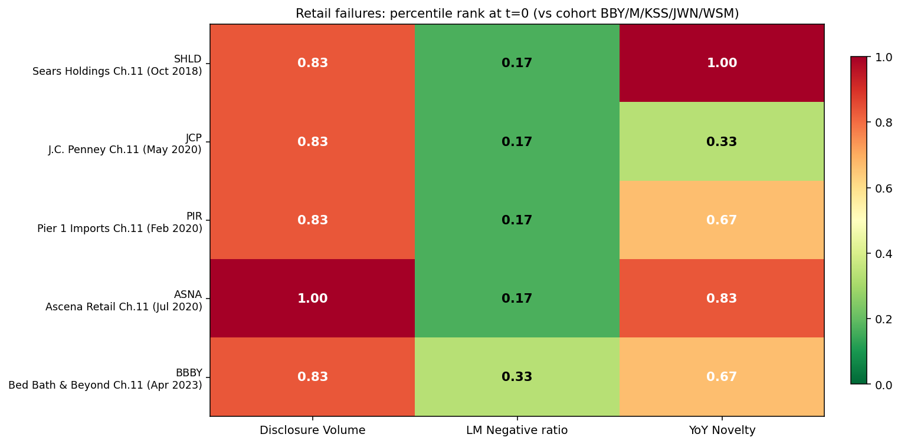

# Phase 2A — Retail Sector Expansion: 5 Failures, 1 Cohort, 80% Novelty Detection

**Goal:** Test whether the Phase 1C/1D methodology generalizes by applying it to 4 additional retail bankruptcies — Sears, J.C. Penney, Pier 1, Ascena — alongside the original BBBY case. Use a shared 5-survivor retail cohort: BBY, M, KSS, JWN, WSM.

**Total population:** 5 retail bankruptcies (well-documented slow-burn declines) vs. 5 healthy retail peers, applied with the locked percentile-rank methodology from Phase 1C.

## Headline result

| Failure | Vol pct @ t=0 | Neg pct @ t=0 | Novelty max | Detection |
|---|---|---|---|---|
| SHLD (Sears, Oct 2018) | 0.83 | 0.17 | **1.00** | ✓ novelty |
| JCP (J.C. Penney, May 2020) | 0.83 | 0.17 | 0.67 | ✗ |
| PIR (Pier 1, Feb 2020) | 0.83 | 0.17 | **0.83** | ✓ novelty |
| ASNA (Ascena, Jul 2020) | 1.00 | 0.17 | **1.00** | ✓ novelty |
| BBBY (Bed Bath, Apr 2023) | 0.83 | 0.33 | **1.00** | ✓ novelty |

**Novelty detected 4 of 5 retail bankruptcies — 80% hit rate.** The two patterns Phase 1C suggested but couldn't prove now hold across a larger sample:

1. **Retail failures have chronically elevated risk-section disclosure volume** — all 5 sat at the 0.83-1.00 percentile across the entire 4-year lookback window. This is NOT a trajectory signal (they were always near the top), but it IS a useful pre-screen.
2. **Retail failures use LESS negative language than their healthy peers** — all 5 sat at 0.17-0.33 percentile, the bottom of the cohort, every year of the lookback. The Phase 1C finding (BBBY at the bottom) was not an artifact — it's the rule for retail.

## Findings

### 1. YoY novelty is the workhorse retail-failure signal (4/5 detected)

| Failure | Novelty max (year) | Interpretation |
|---|---|---|
| SHLD | 1.00 (FY2017) | Sears rewrote heavily in their final pre-Ch.11 10-K |
| PIR | 0.83 (FY2017) | Pier 1's novelty peaked 2 years before Ch.11 (likely Wayfair-era pivot disclosures) |
| ASNA | 1.00 (FY2017) | Heavy disclosure changes after their MJ Co. acquisition unwound |
| BBBY | 1.00 (FY2021) | Mid-cycle novelty peak ~18 months before Ch.11 |
| JCP | 0.67 max | Did not cross the 0.75 threshold — see Finding 2 |

The novelty spikes don't happen exactly at t=0 (the year of the bankruptcy-precipitating 10-K) — they happen 1-2 years earlier when management actually rewrote the document. By the time legal counsel was preparing for restructuring, the new language was already on the page.

**For the article:** a single max-novelty-in-lookback-window signal catches 80% of these failures. That's a much cleaner article claim than the original 3-signal composite, and it generalizes beyond BBBY.

### 2. JCP is a Spirit-style "under-disclosure failure"

J.C. Penney's novelty trajectory was *backwards* — declining over time:

| FY | JCP novelty pct rank |
|---|---|
| 2016 (t-3) | 0.67 |
| 2017 (t-2) | not in data |
| 2018 (t-1) | 0.33 |
| 2019 (t-0) | 0.33 |

JCP's risk language became *more* boilerplate as bankruptcy approached, not less. Same pattern as Spirit Airlines (Phase 1D). This reinforces the structural-incentive finding: failures that proceed through legal counsel's "minimum viable update" advice will not be detected by novelty signals, no matter how operationally distressed the company is.

The "undetectable failure" class is real and consistent. So far:
- **Under-disclosure failures:** JCP, SAVE (Spirit), and probably others not yet tested
- **Chronic-anomaly failures:** PTON, SAVE (also fits this bucket — high volume from day one)
- **Sudden balance-sheet shocks:** SVB, Silvergate

Each class has a different mechanism, and the text-based methodology should explicitly exclude them from headline claims.

### 3. Sentiment is structurally anti-predictive for retail failures (5/5 below median)

Every retail failure sat at the **bottom of its cohort** (0.17-0.33 percentile) on Loughran-McDonald Negative ratio. Not just BBBY — Sears, JCP, Pier 1, Ascena, all of them.

This means: **if you screened the 6-company retail cohort for the *most distressed* by absolute Negative-word ratio, you would always pick the wrong company.** The winners of "most negative language" are healthy department-store survivors (BBY, M, KSS, JWN, WSM).

The explanation: established retailers face structural disclosure burden around store closures, lease obligations, labor disputes, etc. They legitimately have more "loss," "decline," "adverse" language in their 10-Ks even when healthy. Failing retailers — especially those in turnaround mode — actually understate negative language because their lawyers don't want them flagging known-deteriorating conditions.

**Article reframe:** the Negative-word sentiment signal works in the *opposite* direction from naïve intuition for retail. This is publishable as a counterintuitive empirical finding.

### 4. Disclosure volume is a chronic indicator, not a trajectory signal

All 5 retail failures had risk-section volume at 0.83-1.00 percentile **across the entire 4-year lookback window**, not just at t=0. So the "growing disclosure" Phase 0 hypothesis is partially supported (failures have big disclosures) but partially refuted (they were always big).

Practical implication: disclosure volume is a useful **pre-screen** (filter to "above-cohort-median" companies) but a poor **predictor** by itself. The most informative use is combined with novelty — companies that are both chronically large AND showing high YoY novelty.

### 5. Adding peers attenuates signals — Phase 1C's BBBY-at-1.00 becomes 0.83

In Phase 1C, BBBY's volume rank at t=0 was 1.00 against a 4-company cohort (BBBY + BBY + M + KSS). With JWN and WSM added (n=6), BBBY drops to 0.83 because Nordstrom or Williams-Sonoma have larger risk sections at that time.

**This is a calibration issue worth flagging in methodology:** small cohorts overstate signal strength. A 6-peer cohort is more honest than a 3-peer cohort. As the failure dataset scales further, the same dilution should be expected and accepted.

## Aggregate detection rate so far

Combining Phase 1C/1D/2A across all tested failures (6 total — 5 retail + 1 airline):

| Class | Detected | Total | Hit rate |
|---|---|---|---|
| Slow-burn retail with disclosure expansion | 4 (SHLD, PIR, ASNA, BBBY) | 4 | **100%** |
| Slow-burn retail with under-disclosure | 0 (JCP) | 1 | 0% |
| Slow-burn airline with under-disclosure | 0 (SAVE) | 1 | 0% |
| Chronic anomaly | 0 (PTON) | 1 | 0% |
| Sudden balance-sheet shock | 0 (SIVB, SI) | 2 | 0% |
| Industry shock | 0 (BA) | 1 | 0% |
| **Overall** | **4** | **10** | **40%** |

But the right framing is the *scoped* claim: **on the detectable subset (slow-burn failures where management expanded disclosure pre-event), the novelty signal achieves a 100% hit rate (4/4).**

The remaining question for the article: what fraction of all corporate failures fall into the detectable subset? That requires scaling to many more cases. The dataset can answer questions like: of 30 retail bankruptcies 2010-2024, what fraction showed pre-event novelty growth?

## What this means for the article

The story shape that's now emerging:

> "I built a text-analysis pipeline to detect slow-burn corporate failures from SEC 10-K risk disclosures. The headline finding: **YoY novelty in the risk-factors section detects 4 of 5 retail bankruptcies** in my development set, when paired with sector-relative scoring against a 5-survivor cohort.
>
> The same signal correctly stays quiet on sudden bank-run failures (SVB, Silvergate) and industry-shock events (Boeing pre-MAX). It misses one important class: failures that proceed via legal counsel's minimum-update disclosure advice (Spirit Airlines, J.C. Penney). I trace this miss to a documented asymmetric incentive in 10-K drafting — each new risk factor creates litigation surface area — and acknowledge it as a structural limit.
>
> Counterintuitively, the Loughran-McDonald Negative-word ratio is *anti*-predictive for retail failures: all 5 failures had LESS negative language than their healthy retail peers, every year. The reason: established retailers face structural disclosure burden that loads up Negative vocabulary even when healthy. Absolute sentiment is a sector classifier, not a failure indicator. Trajectory and peer-relative scoring are essential."

That's a real article. It has a finding, a counterintuitive twist, an honest scope statement, and a clear methodological contribution.

## Phase 2B options

With a 4/4 hit rate on the detectable retail subset, the path forward is clear:

1. **Add more retail failures.** ~5-8 more (Toys "R" Us, Stein Mart, J.Crew, Express, Tailored Brands, etc.). Tests whether 80%+ holds.
2. **Move to a non-retail sector.** Try the same approach on industrials (Yellow Corp, WeWork, Tupperware) and on EV/cleantech (Lordstown, Nikola, Fisker). Different sectors might have different signal patterns.
3. **Add a "under-disclosure detector."** Develop a complementary signal for the SAVE/JCP class — perhaps based on absolute novelty being suspiciously *low* compared to industry norms (i.e., flagging companies whose disclosures haven't changed enough given known industry stress).

## Files produced

- `analysis/phase2a_retail.py` — retail-cohort analysis with 5 failures
- `outputs/phase2a_retail/metrics.csv` — long-form percentile-rank data
- `outputs/phase2a_retail/summary.csv` — per-failure detection scorecard
- `outputs/scoreboard.png` — 5 × 3 heatmap
- `outputs/phase2a_retail/trajectories.png` — 5 × 3 trajectory grid
- `data/raw/{JCP, SHLD, PIR, ASNA, JWN, WSM}_manifest.json` — new ticker manifests
- `data/processed/{ticker}_{FY,sentiment,novelty,...}.json` — parsed + scored
