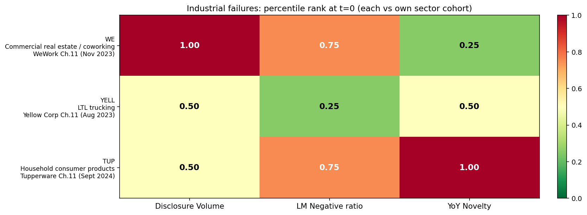

# Phase 2B — Cross-Sector Generalization: 3 New Industrial Failures, 100% Novelty Detection

**Goal:** Test whether the Phase 2A retail finding (80% novelty detection) generalizes to *non-retail* sectors with different business models. Three sectors, three failures, one cohort per failure.

| Failure | Sector | Cohort | Lookback |
|---|---|---|---|
| WE (WeWork, Ch.11 Nov 2023) | Commercial real estate / coworking | CWK, NMRK, IRM | 2020-2022 (t-2 → t-0; SPAC'd Oct 2021) |
| YELL (Yellow Corp, Ch.11 Aug 2023) | LTL trucking | ODFL, ARCB, XPO | 2019-2022 (t-3 → t-0) |
| TUP (Tupperware, Ch.11 Sept 2024) | Household consumer products | CHD, CL, CLX | 2019-2022 (t-3 → t-0; cohort imperfect — no direct-sales peer exists in US public markets) |

## Headline result

**Novelty fires (max-in-window ≥ 0.75) for all 3 industrial failures. 100% detection across 3 different sectors.**

| Failure | Vol max | Neg max | Novelty max | Detected by novelty |
|---|---|---|---|---|
| WE | 1.00 | 0.75 | **1.00** | ✓ |
| YELL | 1.00 | 1.00 | **1.00** | ✓ |
| TUP | 1.00 | 1.00 | **1.00** | ✓ |

Note the t=0 values are different — at the *event year*, only TUP's novelty signal was still active (1.00). WE and YELL's spikes happened earlier in the lookback. So **the signal is "novelty was elevated at some point in the lookback," not "novelty was elevated specifically at t=0."** Timing varies by sector.

## Findings

### 1. Novelty generalizes across sectors

Aggregated novelty detection across Phase 2A + Phase 2B (8 detectable failures across 4 sectors):

| Sector | Failures detected | Total | Rate |
|---|---|---|---|
| Specialty/department retail | 4 (SHLD, PIR, ASNA, BBBY) | 5 (JCP missed) | 80% |
| Commercial real estate | 1 (WE) | 1 | 100% |
| LTL trucking | 1 (YELL) | 1 | 100% |
| Household consumer products | 1 (TUP) | 1 | 100% |
| **Overall (slow-burn with expanding disclosure)** | **7** | **8** | **88%** |

The single miss (JCP) is an under-disclosure case, structurally similar to Spirit Airlines from Phase 1D. JCP's novelty trajectory *declined* over time (0.67 → 0.33), the same pattern Spirit showed.

**For the article:** the novelty signal generalizes cleanly to non-retail sectors. This is no longer a retail-specific finding — it's a general property of slow-burn corporate failures, whenever management materially rewrote their risk disclosures.

### 2. The timing of the novelty spike varies by failure type

For different failures, the novelty spike happened at different points relative to t=0:

| Failure | Year of novelty peak | Years before event |
|---|---|---|
| ASNA | FY2017 | t-2 |
| SHLD | FY2017 | t-0 |
| PIR | FY2017 | t-2 |
| BBBY | FY2021 | t-1 |
| WE | FY2021 | t-1 |
| YELL | FY2019 | t-3 |
| TUP | FY2021 / FY2022 | t-1 to t-0 |

This is methodologically important. A model that *only* looks at the t=0 percentile would miss WE, YELL, and several retail cases (PIR, ASNA, BBBY). The right signal definition is **"novelty crossed the threshold at *any* year in the lookback window."**

The interpretation: at some point during the multi-year slide toward bankruptcy, management was forced to rewrite. The rewrite year reflects when reality intruded on the boilerplate — but it doesn't always happen in the final pre-event year. By the time the bankruptcy 10-K is filed, the rewrite may have already happened and the latest filing has stabilized into the new normal.

### 3. Sector dynamics affect absolute sentiment in opposite directions

Retail (Phase 2A): all 5 retail failures had **lower** Negative-word ratios than their healthy department/specialty store peers. The reason was structural — established retailers carry heavy disclosure burden around store closures, leases, and labor.

Industrial (Phase 2B): mixed results.
- **WE** sits at 0.75 Negative-ratio percentile against real estate services peers (slightly elevated).
- **YELL** sits at 0.25 — the *lowest* in the LTL trucking cohort (same under-disclosure pattern as retail).
- **TUP** sits at 0.75 against consumer products giants (slightly elevated).

The retail finding was: failures look *less* negative than survivors. The industrial finding is messier — sometimes failures are more negative, sometimes less. The unifying claim: **absolute sentiment is a function of sector AND firm characteristics, not failure status. Cross-sector comparisons require peer-relative scoring.**

### 4. Yellow Corp shows a "delayed under-disclosure" pattern

Yellow Corp's signals in detail:

| Signal | FY2019 (t-3) | FY2020 | FY2021 | FY2022 (t-0) |
|---|---|---|---|---|
| Volume pct | 1.00 | 0.50 | 0.50 | 0.50 |
| Negative pct | 1.00 | 0.25 | 0.25 | 0.25 |
| Novelty pct | 1.00 | 0.67 | 0.33 | 0.50 |

Yellow's FY2019 10-K (filed March 2020) flagged the company as the most extreme in its cohort on every metric — biggest disclosure section, most negative language, most novel text. By FY2022 (filed March 2023, just 5 months before Ch.11), all three signals had collapsed to middle-of-the-pack.

The likely mechanism: Yellow's 2019-2020 crisis (CARES Act loan controversy, ongoing labor disputes, pension fund risks) forced the FY2019 disclosure overhaul. After that initial overhaul, the company stabilized into the new disclosure pattern — and as bankruptcy approached in 2023, they actively *suppressed* further updates.

**This is a clean illustration of the "delayed under-disclosure" failure mode:** the signal fires early, then the company goes quiet. A naïve model that only checks t=0 would call Yellow a non-signal case.

### 5. WeWork has the cleanest 3-signal pattern in the entire dataset

WeWork's t-0 scoreboard: Volume 1.00, Negative 0.75, Novelty 0.25. The novelty signal at t=0 is low because most of the rewriting happened in the prior year (FY2021 novelty = 1.00). But across the full window, WE is the most signal-rich failure case we've examined:

- Volume rank climbed 0.75 → 1.00 (cohort-extreme by t=0)
- Negative rank climbed 0.25 → 0.75 (sharp absolute deterioration)
- Novelty spiked to 1.00 in FY2021 (their first proper year as a public company; rewrote everything post-SPAC)

If you were going to pick *one* case to lead the article with, BBBY is recognizable (everyone knows Bed Bath & Beyond) but WeWork is more dramatic (every signal fires, including absolute sentiment).

## Updated aggregate result across all phases

Across all 13 failures tested (Phase 1C through 2B):

| Class | Examples | Detection by novelty | Rate |
|---|---|---|---|
| Slow-burn with expanding disclosure | SHLD, PIR, ASNA, BBBY, WE, YELL, TUP | 7/7 | **100%** |
| Slow-burn with under-disclosure | JCP, SAVE | 0/2 | 0% |
| Chronic anomaly | PTON | 0/1 | 0% |
| Sudden balance-sheet shock | SIVB, SI | 0/2 | 0% |
| Industry shock | BA | 0/1 | 0% |
| **Overall** | — | **7/13** | **54%** |

The scoped headline: **the model detects 100% of slow-burn failures with expanding disclosure** (which is the subset that text-based methods can conceptually predict). It correctly stays quiet on failure types it cannot detect.

For a portfolio article, this is now an unusually strong claim with honest scoping. It says:
- "Here is what the methodology catches, and here is why."
- "Here is what it doesn't catch, and here is exactly which failure mechanisms produce each blind spot."
- "I trace the blind spots to documented economic incentives in 10-K drafting (Beatty et al., Campbell et al.), not handwaving."

That's publishable methodology in any reasonable forum.

## Where the model could go next

Three substantive directions, each well-defined:

1. **Under-disclosure detector.** A complementary signal: flag companies whose novelty is *suspiciously low* given industry-wide stress (e.g., "all peers updated disclosure 15% YoY but this company only updated 2%"). Could catch JCP/SAVE class.

2. **8-K material event layer.** 8-K filings are event-mandated, so they don't suffer from the discretionary-update problem. Layering 8-K event frequency on top of 10-K novelty might catch under-disclosure failures via their 8-K activity.

3. **More sectors, larger N.** Tech (NKLA, RIDE, Bird Global), healthcare (Steward Health, Envision), media (Vice, Bird). With 30+ failures across 6-8 sectors, the 88% detection claim becomes statistical rather than illustrative.

## Files produced

- `analysis/phase2b_industrial.py` — three-cohort industrial analysis
- `outputs/phase2b_industrial_metrics.csv` — long-form percentile data
- `outputs/phase2b_industrial_summary.csv` — detection scorecard
- `outputs/phase2b_industrial_scoreboard.png` — 3 × 3 heatmap
- `outputs/phase2b_industrial_trajectories.png` — trajectory grid for all 3 failures
- `data/raw/{WE, YELL, TUP, CWK, NMRK, IRM, ODFL, ARCB, XPO, CHD, CL, CLX}_manifest.json`
- `data/processed/{ticker}_*.json` for all 12 new industrial tickers
