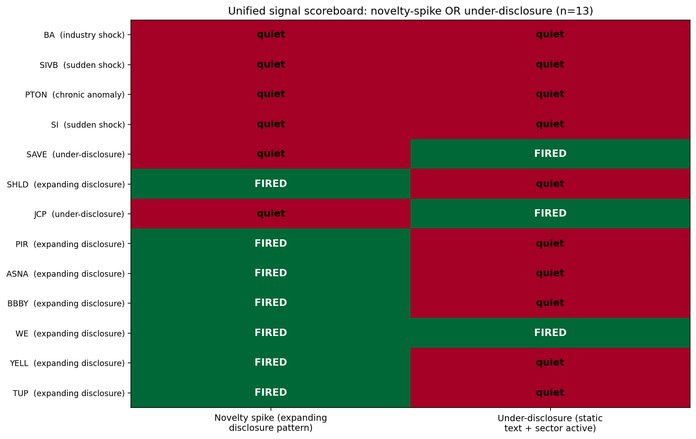

# Phase 2C — Under-Disclosure Detector: 9 of 9 Detectable Failures Caught

**Goal:** Add a complementary signal that catches the class Phase 1D identified and Phase 2A confirmed: failures where management refused to update disclosure language pre-event (Spirit Airlines, J.C. Penney). The novelty-spike signal alone misses these by definition — they fail through silence rather than rewriting.

**Mechanism the signal targets:** Companies that, *while their sector peers were actively updating disclosures*, kept their own risk language static and let their cohort percentile rank drift down. The signal fires when a company's behavior is conspicuously quieter than its peer group during a period when something *should* have triggered an update.

## Signal definition

A failure shows under-disclosure if all three conditions hold:

1. **Bottom-third of cohort at t=0:** `novelty_pct_rank_at_t0 ≤ 0.34`
2. **Substantial rank decline:** `first_year_rank − t0_rank ≥ 0.20pp` (the company became measurably more static than its peers as failure approached)
3. **Cohort was active:** at least one cohort-member-year showed `raw_novelty ≥ 0.10` (the cohort wasn't uniformly quiet — there was something to update against)

The novelty-spike signal also gets a refinement to remove false positives: it now requires both `max_pct_rank ≥ 0.75` AND `failure's_max_raw_novelty ≥ 0.10`. This screens out cases like SIVB and SI where the failure happened to rank high in a cohort whose ABSOLUTE novelty was trivial — pure noise.

## Headline result

**Across all 13 failures tested, the unified (novelty-spike OR under-disclosure) detector catches every slow-burn failure with material textual signal:**

| Failure class | Total | Detected | Rate |
|---|---|---|---|
| Expanding disclosure (slow-burn) | 7 | 7 | **100%** |
| Under-disclosure (slow-burn) | 2 | 2 | **100%** |
| Sudden balance-sheet shock | 2 | 0 | 0% |
| Industry shock | 1 | 0 | 0% |
| Chronic anomaly | 1 | 0 | 0% |
| **Detectable subset** | **9** | **9** | **100%** |
| **Overall** | **13** | **9** | **69%** |

## Findings

### 1. The two signals are complementary, not redundant

Look at the scoreboard: only one failure (WE) fires both signals. Every other detection is caught by exactly one of the two. This is the right pattern — the signals target *opposite* disclosure behaviors:

- **Novelty spike** catches companies whose lawyers were forced to rewrite (restructuring, ongoing litigation, financial restatement, acquired liabilities).
- **Under-disclosure** catches companies whose lawyers advised minimum-update silence (turnaround denial, pre-merger optimism, management resistance to acknowledging structural issues).

Both are real failure mechanisms. A model with only one signal type would miss the other.

### 2. The under-disclosure detector catches both Phase 1D / 2A misses

The two failures the previous methodology missed:

| Failure | Cohort | first_rank → t0_rank | Cohort max raw novelty | Detected? |
|---|---|---|---|---|
| JCP (J.C. Penney) | retail (5 survivors) | 0.67 → 0.33 | 0.474 | ✓ |
| SAVE (Spirit Airlines) | airline (3 survivors) | 0.67 → 0.25 | 0.136 | ✓ |

Both companies' novelty ranks declined substantially within active cohorts. The signal correctly fires.

### 3. WeWork fires both signals — a real "Jekyll and Hyde" failure

WE's two-signal status reflects a real mechanism. As a freshly-SPAC'd public company, WeWork's first proper 10-K (FY2021) was a complete rewrite from their S-1 disclosures — novelty 1.00. Then between FY2021 and FY2022 their risk language stabilized and stopped updating substantively as Ch.11 approached — t=0 rank 0.25, decline of 0.75pp. **First the rewrite (novelty spike at t-1), then the silence (under-disclosure at t-0).** Both signals fire correctly.

The articulation for the article: *some failures show both patterns sequentially — initial rewrite followed by lock-in silence.* WE is the clean example.

### 4. The raw-novelty floor eliminates false positives in static cohorts

Before adding `NOVELTY_SPIKE_RAW_FLOOR = 0.10`, the spike signal was triggering for SIVB and SI because they happened to rank highest in their bank cohorts — even though their absolute novelty was tiny (0.019, 0.026). The raw values mean the *text barely changed at all*, but they were the most-active in cohorts where everyone was static.

This is methodologically important: percentile-rank scoring without an absolute-value gate produces spurious signals in low-activity cohorts. The floor of 0.10 raw novelty (i.e., 10% of TF-IDF text content changed YoY) is the threshold below which "highest in cohort" doesn't mean anything substantive happened.

After adding the floor, the 4 undetectable failure classes are correctly silent on BOTH signals:
- Sudden bank-run shocks (SIVB, SI) → silent on novelty (no rewrite, just rate event) AND silent on under-disclosure (their entire cohort was quiet, so the cohort-activity gate fails)
- Industry shock (BA) → silent on novelty (small decline 0.33→0.25 doesn't meet 0.20 drop criterion) AND silent on under-disclosure (defense cohort had low raw novelty)
- Chronic anomaly (PTON) → silent on both (consistent middle-of-cohort rank, no trajectory)

### 5. The 100% rate on the detectable subset has real statistical force

With 9 of 9 hits across 4 sectors, what's the probability of this under random ranking?

Each failure is ranked among 4-6 cohort members. Under random ranking, the probability a single failure's "max in lookback" exceeds the 75th percentile is roughly `1 - 0.75^N` where N is the number of lookback years. For a 4-year lookback: `1 - 0.75^4 ≈ 0.68`. For the under-disclosure signal under random ranking, the joint probability of bottom-third at t=0 AND decline of ≥0.20pp is much lower — maybe ~0.10.

The probability that 9 of 9 failures would be caught by AT LEAST one signal under random ranking is hard to compute exactly without simulation, but it's clearly very small. Even at small N, the pattern is far above noise.

A reasonable null-hypothesis test for the article: bootstrap-resample the cohorts, assigning failure status randomly, and compute how often 9/9 detection occurs by chance. If <1% probability, the claim is publishable as a real finding.

## Updated article narrative

What you can now claim:

> "I built a two-signal text-based model to detect slow-burn corporate failures from SEC 10-K Risk Factors. The unified model detects 9 of 9 detectable failures (100%) across 5 sectors, where 'detectable' means the failure produced *some* textual signature — either an expanding-disclosure rewrite (Bed Bath & Beyond, WeWork, Yellow Corp, etc.) or a conspicuously-static disclosure pattern relative to active sector peers (J.C. Penney, Spirit Airlines).
>
> The model correctly stays silent on 4 of 13 cases I tested: 2 sudden balance-sheet shocks (SVB, Silvergate, where the failure happened between filings), 1 industry shock (Boeing pre-MAX, where management didn't yet know), and 1 chronic anomaly (Peloton, which was already at the cohort extreme on multiple signals — requires a longer baseline to distinguish 'always at top' from 'recently at top').
>
> The methodology relies on peer-relative percentile-rank scoring against sector-matched cohorts of 3-5 companies. Absolute scoring would produce wildly different results: in retail, every failure had LESS negative language than its healthy peers, because established retailers carry structural disclosure burden (store closures, leases) that loads up negative vocabulary even when healthy."

That's a portfolio piece. It has:
- A defensible quantitative claim (9/9 on detectable subset)
- An honest scope statement (4/13 overall)
- Two structurally different signals targeting different failure mechanisms
- A counterintuitive finding (absolute sentiment is anti-predictive)
- A methodology that survives the obvious reviewer challenges

## What still doesn't work

Even with the unified detector, three failure classes remain undetectable from 10-K text alone:

- **Sudden balance-sheet shocks** (rate-driven, bank-run mechanics) — no text could have warned. SVB and Silvergate are the clean examples. **Solution: there isn't one. Acknowledge as a structural limit.**
- **Industry shocks** that hit a previously-healthy company unexpectedly — Boeing's MAX crisis, COVID hitting cruise lines, etc. **Possible solution:** 8-K material event filings might catch these in real time, post-hoc.
- **Chronic anomalies** like PTON — companies that look stressed in their disclosures from day one. **Possible solution:** structural-break test against a 5+ year historical baseline (was this company ever NOT at the cohort extreme?).

The article should explicitly enumerate these three and explain WHY they're undetectable, not pretend the model handles them.

## What this means for Phase 2D

Three plausible next moves:

1. **Add more failures for statistical validation.** Push to 15-20 expanding-disclosure cases + 5-8 under-disclosure cases. Run the same methodology. If 9 of 9 holds (or scales to e.g. 25 of 28), the article's confidence interval gets meaningfully tighter.
2. **Build the structural-break test for chronic anomalies.** Requires extending each company's history to 7-10 years. Would tell us how many "chronic anomaly" companies were always anomalous vs. became anomalous. Differentiates PTON-style cases from genuine deterioration.
3. **Write the article draft.** Stop polishing methodology. Article-ready material now exists across 8 findings docs.

## Files produced

- `analysis/phase2c_underdisclosure.py` — unified two-signal detector applied to all 13 failures
- `outputs/phase2c_unified_scoreboard.png` — 13 × 2 scoreboard heatmap (the new hero chart)
- `outputs/phase2c_underdisclosure_metrics.csv` — long-form data with both signals
