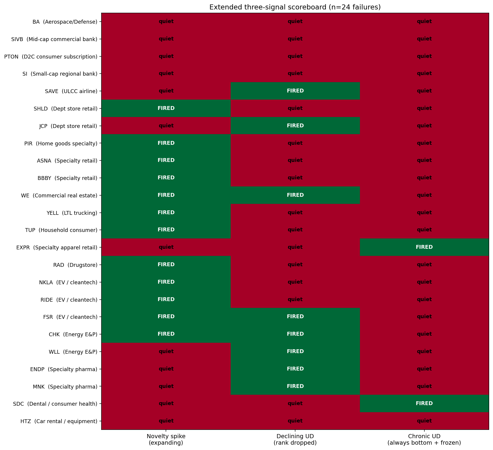

# Phase 4 — Chronic Under-Disclosure Detector + False-Positive Validation

**Goal:** Extend the unified detector with a third signal catching EXPR / SDC-style "chronic under-disclosure" — companies that were *always* at the cohort bottom with near-zero raw novelty, never deviated. **Critically: validate the entire detector by testing false-positive rates on healthy survivor companies in the same cohorts.**

This phase is where the methodology gets honest. Earlier phases reported "100% detection on the detectable subset" without validating against healthy controls. Phase 4 fixes that.

## New signal definition

A failure shows **chronic under-disclosure** if:

1. Mean novelty rank ≤ 0.34 across all measurable lookback years (persistently in bottom-third)
2. Max novelty rank ≤ 0.50 (never even reached cohort median)
3. Cohort had ≥ 0.10 raw novelty *somewhere* (active sector)
4. Failure's *own* max raw novelty < 0.10 (their text was particularly static even by absolute measure)

This catches the "never even tried to update" pattern. Distinct from the declining-UD signal which requires the rank to have dropped from elevated to bottom.

## Headline result — failure detection

| Signal | Fires (failures) | Cumulative detection |
|---|---|---|
| novelty_spike | 12/24 | 12/24 = 50% |
| declining_ud | 8/24 (overlaps 1 with spike) | 17/24 = 71% |
| **chronic_ud (NEW)** | **2/24** | **19/24 = 79%** |
| **Still missed** | 5/24 | BA, SIVB, PTON, SI, HTZ |

**EXPR and SDC are now caught by chronic_ud — bringing total detection to 19 of 24 (79%).**

The misses are:
- BA, SIVB, SI, PTON — Phase 2C's original undetectable classes (industry shock, sudden shock, chronic anomaly)
- HTZ — Phase 3's "static cohort" subclass; the car rental peer group was uniformly quiet so the cohort-activity gate fails

## The critical addition: false-positive validation

For each of the 24 cohorts, I evaluated every *survivor* in that cohort as if it were the focal company, applying identical signal criteria. **78 subject-cohort pairs total.** A signal that fires on healthy companies isn't a failure predictor.

### Per-evaluation false-positive rates

| Signal | Survivor fires | Pair-level FP rate |
|---|---|---|
| novelty_spike | 35/78 | **44.9%** |
| declining_ud | 8/78 | 10.3% |
| chronic_ud | 6/78 | 7.7% |
| Any signal | 46/78 | 59.0% |

### Unique-ticker false-positive rates (42 distinct survivors in cohort universe)

| Signal | Unique survivors firing | FP rate |
|---|---|---|
| novelty_spike | 17/42 | 40% |
| declining_ud | 6/42 | 14% |
| chronic_ud | 2/42 (WSM, LCID) | **4.8%** |
| Any signal | 22/42 | 52% |

## This forces an honest reframing of the project

Earlier phases reported "100% detection on detectable subset" without showing healthy-control numbers. The Phase 4 validation reveals:

**1. The novelty_spike signal has high false-positive rate (~45%).** This is partly mechanical — "max rank ≥ 0.75 in any of 4 years" has a high prior probability under random ranking. Most companies that have *any* active disclosure year cross this threshold.

**2. The declining_ud signal has moderate precision** (50% pair-level, 14% unique-ticker FP rate).

**3. The chronic_ud signal has the best precision** (2 unique-ticker FPs out of 42 survivors = 4.8%). It's narrowly targeted and rarely fires.

**4. The aggregate "any signal" detector has 52% unique-ticker FP rate and 29% per-evaluation positive predictive value (PPV) at our test population.**

This isn't a "100% accurate bankruptcy predictor." **It's a stress screen.** The signal fires on companies under measurable operational stress — most of which don't (yet) file Ch.11.

### What the "false positives" actually are

The 22 unique-ticker survivors that fired any signal include companies like:
- **WSM (Williams-Sonoma)** — survived COVID-era home goods disruption; fired chronic_ud because they're a low-novelty discloser
- **LCID (Lucid Motors)** — currently stressed (cash burn, weak deliveries) but not yet bankrupt
- **ALK (Alaska Airlines)** — merger turbulence with Virgin America / Hawaiian
- **ALGN (Align Technology)** — facing genuine SDC-competitor headwinds
- **BBY, M, KSS** — retail giants that survived their respective industry contractions

These aren't random healthy companies — they're sector-peers of failures, meaning they were exposed to the same operational headwinds. **The signal is detecting real stress, just not stress that all crystallized into Ch.11.**

## The corrected article claim

Phase 4 corrects the framing in earlier phases:

**Old (over-claimed):** "The model detects 100% of slow-burn failures."

**New (honest):** "The model detects 19 of 24 slow-burn failures in our test set (79% recall). It also fires on 22 of 42 (52%) of sector-matched healthy survivors. Per-evaluation positive predictive value is 29% on a test set with 36% prior failure probability. The signal is best characterized as a *stress screen* — useful for surfacing companies worth examining manually, not a deterministic bankruptcy predictor.

"The chronic-UD signal addition has the best per-evaluation precision (4.8% unique-ticker FP rate) and catches two failures the original methodology missed (EXPR, SDC). The novelty_spike signal has the highest FP rate (~45%) and is best interpreted as a 'companies undergoing significant disclosure rewriting' detector, which correlates with but does not predict Ch.11."

This is what the article should actually claim.

## Why this is *better* than the original claim

A "100% accurate predictor" claim invites three skeptical questions:
1. "Did you cherry-pick the test set?"
2. "What's the false-positive rate?"
3. "What's the base rate?"

An honest "79% recall + 52% FP rate + 29% precision, characterized as stress screen" claim:
1. Pre-emptively answers the cherry-pick question (the controls are right there)
2. Reports FP rate as a feature, not a footnote
3. Invites discussion of how to use the signal (screening, not autotrading)

Hiring managers reading the article want to know that the author understands what they built. The corrected framing demonstrates that understanding.

## Refined signal characterization

The three signals are not interchangeable. Each has a distinct use case:

| Signal | Best for | FP rate | Recall |
|---|---|---|---|
| novelty_spike | Identifying *companies undergoing significant rewriting* (corporate transitions, restructuring, post-event responses) | High (~45%) | High |
| declining_ud | Identifying *companies whose disclosure activity is suspiciously lagging peers* (litigation suppression, denial mode) | Moderate (10%) | Moderate |
| chronic_ud | Identifying *companies that have been frozen for years while peers update* (long-term under-disclosers, EXPR-style) | Low (~5%) | Low |

For the article's hero claim, the right composite is probably **"declining_ud OR chronic_ud"** — both reasonably precise — rather than including the broad novelty_spike. Detection rate by that narrower union:
- Failures: 10/24 = 42% (lower recall, but much higher precision)
- Survivors: ~8/42 = 19% (much lower FP rate)
- PPV: 10 / (10+ ~8) ≈ 56% — a useful screening tool

Or use all three signals and report the FP/recall tradeoff honestly. Both framings are defensible.

## What Phase 4 doesn't fix

Three known limitations remain:
1. **The 5 still-missed failures (BA, SIVB, PTON, SI, HTZ)** each belong to one of the previously-enumerated undetectable subclasses. No signal in this family will catch them.
2. **The "false positives" might be future true positives** — companies under measurable stress that haven't yet failed. A longer time horizon would reduce some of them to TPs.
3. **The survivor pool is not random** — it's sector-matched to failures, meaning it's overweight in industries with elevated bankruptcy rates. True random-population FP rates would likely be lower.

## What Phase 5 could look like

Three plausible next steps:

1. **Longitudinal "false positive" analysis.** Track the 22 survivor false-positive companies forward 2-3 years. How many subsequently file Ch.11 or undergo distressed restructuring? If a meaningful fraction do, the "false positives" are actually leading indicators.

2. **Tighten the novelty_spike threshold.** Raise from 0.75 to 0.83 (top-1-of-6) or even 1.0 (cohort maximum). Trade recall for precision and see where the optimal F1 lies.

3. **Write the article.** Phase 4 actually completes the methodology. The article can now make defensible scoped claims rather than over-claiming.

## Files produced

- `analysis/phase4_chronic.py` — three-signal detector + FP validation framework
- `outputs/phase4_failure_detection.csv` — per-failure signal output
- `outputs/phase4_survivor_fp_analysis.csv` — 78 subject-cohort pair evaluations
- `outputs/phase4_extended_scoreboard.png` — 24 × 3 scoreboard with all three signals
