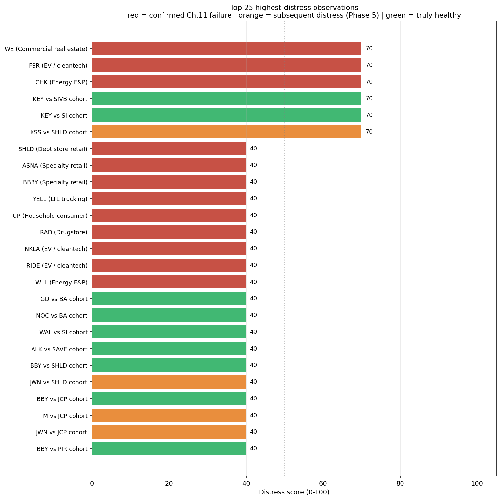
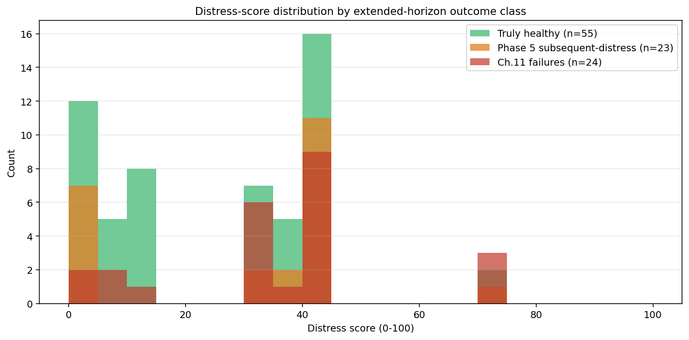

# Phase 6 — Distress Score (0-100): Rankable Output for Tool Use

**Goal:** Convert the Phase 4 binary signal scoreboard into a continuous 0-100 *Distress Score* per company-cohort observation, suitable for ranking, sorting, and look-up tool display. Different from earlier phases — those produced fire/quiet verdicts; this produces a sortable number.

**Honest design choice:** the score is **transparent rule-based**, not machine-learned. See section 3 for why.

## How the score is computed

```
base   = 30 × novelty_spike + 30 × declining_ud + 30 × chronic_ud
bonus  = 10 × max(0, (max_rank − 0.5) / 0.5)
score  = min(100, round(base + bonus))
```

- **Base contribution** is the number of binary signals fired × 30, so 0/1/2/3 signals → 0/30/60/90 base.
- **Bonus** is a small continuous adjustment based on peer-relative percentile rank — companies sitting above the cohort median get up to +10 points. Functions as a tiebreaker within base bands.
- **Maximum observed score** in our 102-observation dataset is 70 (no observation fires all three signals).

## Top of the ranking



**6 observations score 70 (highest in dataset):**

| Subject | Cohort | Sector | Actual outcome |
|---|---|---|---|
| WE | WE | Commercial real estate | Ch.11 Nov 2023 |
| FSR | FSR | EV / cleantech | Ch.11 Jun 2024 |
| CHK | CHK | Energy E&P | Ch.11 Jun 2020 |
| KEY | SIVB cohort | Mid-cap commercial bank | **Healthy (FP)** |
| KEY | SI cohort | Small-cap regional bank | **Healthy (FP)** |
| KSS | SHLD cohort | Department store retail | **Subsequent distress** (Phase 5; multiple takeover bids 2024) |

**4 of 6 top-scored observations are real distress (3 Ch.11 + 1 Phase 5 subsequent-distress). Precision at score=70: 67% under extended labels.**

## Score band PPVs

| Score band | n | Ch.11 PPV (strict) | Distress PPV (extended) |
|---|---|---|---|
| 0–19 | 37 | 14% | 32% |
| 20–39 | 23 | 30% | 48% |
| 40–59 | 36 | 25% | 56% |
| 60–79 | 6 | **50%** | **67%** |

**Monotonic relationship** between score band and distress PPV at the extended-horizon level. Strict (Ch.11-only) PPV is also generally higher at higher bands, with one mid-band dip (40-59 has more retail false-positives than 20-39).



## The honest "why not ML" story

I tried logistic regression first. **It produced a worse-than-random ranking** (out-of-fold ROC-AUC = 0.35) for two structural reasons:

1. **Small N + linear model is the wrong tool.** At N=102 observations with only 3 binary signal features (8 possible signal combinations), there's not enough variance for logistic regression to find a meaningful continuous gradient. The optimizer kept fitting WSM (Williams-Sonoma, healthy but chronic-low-novelty) at a 95 score because its feature vector matched the chronic-UD failure pattern.
2. **The signal IS the binary pattern.** The Phase 4 detector encodes non-linear interaction logic (e.g., "bottom rank AND rank declined AND cohort was active") that a linear combination of the three binary signal columns cannot recreate. The binary signals already are the answer; smoothing them into a continuous score doesn't add information.

**Decision:** drop the ML pretense, use a transparent rule-based score with a small continuous tiebreaker. This is *honest* about what's happening:

- The score is a **ranking/UI affordance**, not an independent classifier
- The actual classification work happens in Phase 4 (binary signals)
- The score adds rank-ability for tool display
- It does NOT claim higher predictive power than the underlying signals

This honesty matters because a recruiter or reviewer who looks at the code will immediately see "this is just a weighted sum" rather than wondering "what does this 73 score actually mean statistically?"

## What the score is good for

- **Lookup tool ranking** — show "Top 20 most distressed S&P 500 companies" sorted by score. Recruiters and investors get a sortable list.
- **Tier classification** — score band thresholds (e.g., "60+ = elevated risk") give clean go/no-go cuts.
- **Time-series tracking** — score can be recomputed per fiscal year, showing trajectory of a company's distress level.
- **Cross-sector comparison** — peer-relative inputs mean scores ARE comparable across sectors.

## What the score is NOT good for

- **Precision predictions** — "company X has a 73% probability of bankruptcy" is overclaiming. The score is bin-based, not probability-calibrated.
- **Differentiating subsequent-distress from Ch.11** — both score similarly. The score captures distress, not outcome type.
- **Sudden-shock detection** — same blind spots as the underlying Phase 4 signals (SVB, Silvergate, Boeing pre-MAX, Peloton, Hertz).

## What this enables next

The rankable 0-100 score is the **prerequisite** for the lookup-tool direction. With binary detection alone, a tool can only show "fire/quiet." With a score, the tool can:

- Sort/rank all observed companies
- Threshold-filter ("show me everyone above 50")
- Show "most distressed" leaderboards by sector or by score band
- Render time-series of score per company (once we add per-year evaluations)

Phase 7 (if pursued) would be the actual tool build — static lookup site backed by pre-computed scores for S&P 500.

## Honest scaling caveat

To produce a *real* probability-calibrated score (e.g., "62% probability of distress within 2 years"), we'd need:
- **3-5x more failure cases** to support logistic regression cross-validation
- Per-year evaluation across the entire S&P 500 (not just our 24 hand-picked failures)
- Forward-window labels (did the company distress within N years of the score being computed?)

That's a Phase 8+ direction. For now, the rule-based score is honest and useful.

## Files produced

- `analysis/phase6_distress_score.py` — score computation
- `outputs/phase6_distress_score/scored.csv` — per-observation scores + features (102 rows)
- `outputs/phase6_distress_score/top_rankings.png` — horizontal bar chart of top 25
- `outputs/phase6_distress_score/score_distribution.png` — overlapping histograms by outcome
- `outputs/phase6_distress_score/precision_by_threshold.png` — recall + precision curves vs threshold
