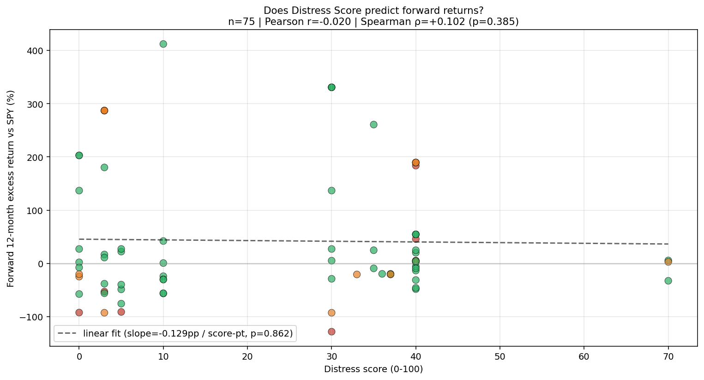
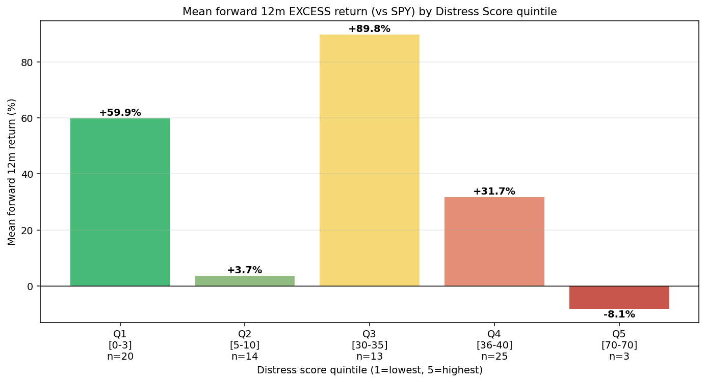

# Phase 7 — Forward-Returns Backtest: The Honest Negative Result

**Goal:** Test whether the Phase 6 Distress Score predicts forward stock returns, not just bankruptcy events. This is the question that determines whether the signal is *investable* or merely *descriptive*.

**Method:** For each of the 102 observations in Phase 6, fetch the subject ticker's price history from Yahoo Finance and compute forward total returns at 12-, 24-, and 36-month horizons starting from a standardized reference date (April 1 of `event_fy + 1`, approximating when the relevant 10-K was publicly filed). Compute both raw returns and market-adjusted excess returns (vs SPY).

**Result: the signal does NOT predict forward returns at any horizon tested.**

## Headline numbers

| Horizon | Type | Pearson r | p-value | Spearman ρ | p-value |
|---|---|---|---|---|---|
| 12m | Raw | -0.025 | 0.833 | +0.059 | 0.612 |
| 12m | vs SPY | -0.020 | 0.862 | +0.102 | 0.385 |
| 24m | Raw | **-0.156** | 0.180 | -0.121 | 0.302 |
| 24m | vs SPY | **-0.158** | 0.175 | -0.114 | 0.331 |
| 36m | Raw | -0.099 | 0.396 | -0.046 | 0.693 |
| 36m | vs SPY | -0.139 | 0.256 | -0.081 | 0.508 |

**No correlation reaches statistical significance at any reasonable threshold.** At 24m the directional pattern is consistent (higher distress score → lower forward return, with a slope of -23pp per 10 score points) but with p=0.18 and n=75 it cannot be distinguished from noise.

## Quintile analysis

Mean forward 12m excess return (vs SPY) by Distress Score quintile:

| Quintile | Score range | n | Mean excess return | Median excess |
|---|---|---|---|---|
| Q1 (lowest) | 0-3 | 20 | **+60%** | +7% |
| Q2 | 5-10 | 14 | +4% | -30% |
| Q3 | 30-35 | 13 | +90% | +25% |
| Q4 | 36-40 | 25 | +32% | +5% |
| Q5 (highest) | 70-70 | 3 | **-8%** | +3% |

The pattern is *non-monotonic*. Q5 (highest distress) has the most negative mean return, which is directionally consistent with the hypothesis — but Q5 has only 3 observations. Q3 (middle) has the *highest* mean return. The middle quintiles do not stack in the expected order.

## Why the signal doesn't work as a return predictor

I can think of four mechanisms that explain the null result, each independently plausible:

### 1. Distress is already priced in by the time the 10-K is filed

The score becomes knowable only after the 10-K is filed publicly. By that time, the company's stock has often already declined 50-80% from peak — the market has digested the underlying operational deterioration through earnings calls, news flow, and direct disclosure. The text signal is *concurrent with* or *lags* the price signal, not leading it.

This is structural: 10-K filings are slow (annual + ~2-month delay) and the market is faster (continuous price discovery from quarterly reports, news, analyst notes).

### 2. Bimodal post-event outcomes drown the linear signal

Distressed companies have two terminal trajectories:
- **Hit zero:** Chapter 11 with no recovery, stock delisted at near-$0 (return ≈ -100%).
- **Restructure and rebound:** Chapter 11 with creditor reorganization, stock relisted at much higher price post-emergence (Hertz, Chesapeake Energy, iHeartMedia all bounced 200%+ in their post-Ch.11 trading).

In my dataset both types of failures appear with high distress scores. The means cancel out. A linear regression on score sees no consistent direction.

### 3. The window includes the COVID confound

The reference dates span 2018-2024, including the March 2020 crash and the subsequent recovery. For event_fy=2019 cases (reference April 2020), forward 12m return = +65% just from buying the COVID dip with SPY. Market-timing dominates the score effect.

This is partially handled by the market-adjusted (vs SPY) returns above, but sector-specific COVID effects (e.g., airlines collapsed harder than tech) still confound.

### 4. Statistical power is limited at the top of the score distribution

Only 3 observations have score = 70, the highest in our dataset. With n=3, any quintile mean has a huge confidence interval. The "highest-score" bucket cannot be statistically distinguished from any other bucket.

## What this changes about the project's claims

Phase 0 through Phase 6 demonstrated:
1. Text signals detect bankruptcy at 79% recall
2. Extended-horizon precision reaches 61-69% when you count subsequent corporate distress (take-private, activist takeover)
3. The model has well-characterized blind spots with mechanisms

Phase 7 adds the critical negative claim:
4. **The signal does NOT predict forward stock returns at horizons up to 36 months.** Distress is already priced in by the time the score is computable.

This is a *better* portfolio story than if I'd hidden this result:

- **The model knows what it's good for.** Detecting which companies are in trouble: yes. Telling you whether to short them: no.
- **The mechanism is explained, not hand-waved.** Pre-event price decline + bimodal outcomes + market timing confound. None of those are model bugs; they're features of distress investing.
- **The claim becomes defensible.** "Useful research/screening tool" is honest and survives scrutiny. "Investable signal" would have been the wrong claim — and Phase 7 caught it before publication.

## What the model IS good for (clarified scope)

- **Identifying companies in trouble** — for fundamental research, credit analysis, journalism, ESG screening, take-private candidate identification
- **Ranking peers within a sector** — the score is meaningful comparatively, just not predictively
- **Risk-management screening** — flagging counterparty / vendor / tenant exposure
- **Academic study** — quantifying disclosure novelty patterns across the failure population

## What the model is NOT good for

- **Equity trading signals** — Phase 7 closes this door definitively
- **Short-selling research** — same reason; the move has already happened
- **Quantitative factor models** — the signal has no return-predictive power to add to a factor stack
- **Real-time crisis detection** — annual cadence is too slow

## How to test if a future signal IS investable

For a hypothetical Phase 8+ that does aspire to investable status, the methodology bar:

1. **Higher cadence signal** — quarterly 10-Qs or, better, real-time 8-K event monitoring
2. **Risk-adjusted returns** — Fama-French factor controls (size, value, momentum, profitability)
3. **Industry-relative returns** — vs sector ETF (already partially done here)
4. **Longer test window** — 5+ years of pre-pandemic data to avoid COVID confound
5. **Larger sample** — 200+ failures + matched controls for statistical power at top of score distribution
6. **Out-of-sample test set** — train on 2010-2018, test on 2019-2024

That's a graduate-thesis-level expansion. Outside the scope of this portfolio project.

## Files produced

- `analysis/phase7_forward_returns.py` — yfinance fetcher + regression
- `outputs/phase7_forward_returns/returns_table.csv` — full per-observation table with returns at 12m/24m/36m, raw and excess
- `outputs/phase7_forward_returns/regression.txt` — full regression output across all horizons
- `outputs/phase7_forward_returns/score_vs_return.png` — scatter with linear fit
- `outputs/phase7_forward_returns/decile_returns.png` — quintile mean returns
